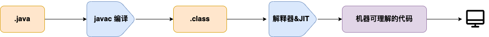

# Java 基础

## java 字节码

.class文件为字节码，可被JVM理解，不面向任何特定处理器，只面向虚拟机

在.class->字节码时，JVM类加载器首先加载字节码文件，然后通过解释器逐行解释执行。这样会较慢，由于有些代码块常被调用，所以引进JIT（just in time compilation）编译器，JIT属于运行时编译。当JIT编译后，会保存字节码对应的机器码，而运行机器码的效率高于Java解释器，所以Java是编译与解释共存。

JVM 会根据代码每次被执行的情况收集信息并相应地做出一些优化，因此执行的次数越多，它的速度就越快。在JDK 9 中引入了AOT (ahead of time compilation)，它是直接将字节码编译成机器码，这样就避免了JIT 预热等各方面的开销。

## 为何不能全部使用AOT

长话短说，这和 Java 语言的动态特性有千丝万缕的联系了。举个例子，CGLIB 动态代理使用的是 ASM 技术，而这种技术大致原理是运行时直接在内存中生成并加载修改后的字节码文件也就是 .class 文件，如果全部使用 AOT 提前编译，也就不能使用 ASM
 技术了。为了支持类似的动态特性，所以选择使用 JIT 即时编译器

## Java和C++的区别

* Java 不提供指针来直接访问内存，程序内存更加安全
* Java 的类是单继承的，C++ 支持多重继承；虽然 Java 的类不可以多继承，但是接口可以多继承。
* Java 有自动内存管理垃圾回收机制(GC)，不需要程序员手动释放无用内存。
* C++ 同时支持方法重载和操作符重载，但是 Java 只支持方法重载

## 基本类型与包装类型的区别

* 成员变量包装类型不赋值就是 null，而基本类型有默认值且不是 null。
* 包装类型可用于泛型，而基本类型不可以。
* 基本数据类型的局部变量存放在Java 虚拟机栈中的局部变量表中，基本数据类型的成员变量（未被 static 修饰 ）存放在 Java 虚拟机的堆中。包装类型属于对象类型，我们知道几乎所有对象实例都存在于堆中。
* 相比于对象类型，基本数据类型占用的空间非常小。

为什么并非所有对象都在堆中？ 这是因为 HotSpot 虚拟机引入了 JIT 优化之后，会对对象进行逃逸分析，如果发现某一个对象并没有逃逸到方法外部，那么就可能通过标量替换来实现栈上分配，而避免堆上分配内存

| 基本类型 | 位数 | 字节 | 默认值  | 取值范围                                   |
| -------- | ---- | ---- | ------- | ------------------------------------------ |
| byte     | 8    | 1    | 0       | -128 ~ 127                                 |
| short    | 16   | 2    | 0       | -32768 ~ 32767                             |
| int      | 32   | 4    | 0       | -2147483648 ~ 2147483647                   |
| long     | 64   | 8    | 0L      | -9223372036854775808 ~ 9223372036854775807 |
| char     | 16   | 2    | 'u0000' | 0 ~ 65535                                  |
| float    | 32   | 4    | 0f      | 1.4E-45 ~ 3.4028235E38                     |
| double   | 64   | 8    | 0d      | 4.9E-324 ~ 1.7976931348623157E308          |
| boolean  | 1    |      | false   | true、false                                |

boolean的占用空间依赖于JVM的实现，因为要考虑到高效存储的因素

## 包装类型的缓存机制

Byte, Short, Integer, Long默认创建[-128, 127]的缓存数据，Character创建了[0, 127]的缓存，Boolean返回True和False

```java
Integer i1 = 33;
Integer i2 = 33;
System.out.println(i1 == i2);// 输出 true

Float i11 = 333f;
Float i22 = 333f;
System.out.println(i11 == i22);// 输出 false

Double i3 = 1.2;
Double i4 = 1.2;
System.out.println(i3 == i4);// 输出 false

Integer i1 = 40;
Integer i2 = new Integer(40);
System.out.println(i1==i2);// 输出  False
```
