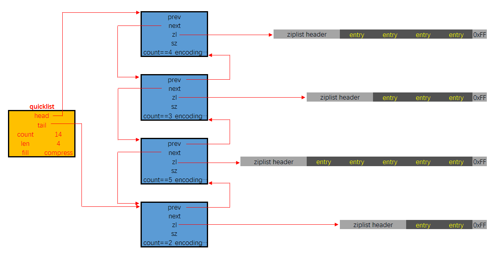
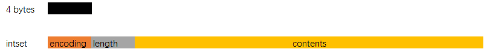
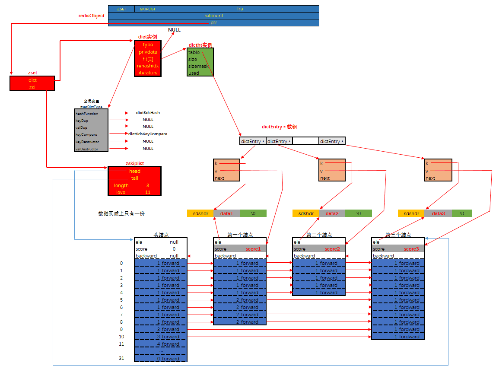

# Redis

## Redis 用处

基于内存，可持久化，键值对形式，包含String，List，Set，Sorted Set，Hash，Stream，LogLog，Bitmap

根据2-8原则，将20%的热点数据存储到Redis，对于一些实时性要求高的场景更优，比如点赞，排行。

## 数据类型

| 数据类型    | 描述                                                                 | col3 |
| ----------- | -------------------------------------------------------------------- | ---- |
| String      | 二进制安全的字符串                                                   |      |
| List        | 双向链表                                                             |      |
| Set         | 无序集合，底层是intset或hashtable                                    |      |
| Hash        | 键值对                                                               |      |
| Zset        | 有序集合                                                             |      |
| geo         | 地理空间                                                             |      |
| HyperLogLog | 基数统计，输入元素数量或体积非常大，<br />计算基数（去重数据量）较小 |      |
| bitmap      | 位图                                                                 |      |
| bitfield    | 一次性操作多个比特位                                                 |      |
| stream      | 流                                                                   |      |

## 键操作

16个库，默认使用第一个，select dbindex查看，move key dbindex 2 移动数据，select 3 切换至3号库

set 设置string，keys *查看所有键，dbsize查看key数量

flushdb 清空当前库，flushall 清空所有

命令不区分大小写，但key区分

### String

最大512M，set key value，get key

set 参数

- NX 键不存在时设置
- XX 键存在时设置
- GET 返回值改为原始值
- 过期时间 PX毫秒 EX秒 EXAT unix时间戳（秒）PXAT unix时间戳（毫秒）KEEPTTL
- TTL 修改时保留原过期时间（默认修改值时会重置过期时间）

mset mget，可批量添加获取键。msetnx，当键不存在时批量插入，原子操作，当部分键存在会导致所有插入失效

getrange：相当于substring，setrange，修改部分字符串，只需指定起始位置

incr|decr key [offset] 只能修改整型，浮点不行

setex key time value 设置键和过期时间，是原子操作，set 和 expire的结合

### List

最多2e23-1个元素，用于栈，队列，消息队列

lpush，rpush，lpop，rpop，lrange，没有rrange

lindex key index 获取指定元素 llen 获取长度

lrem key value num，从左删除等于指定值的num个元素

ltrim key start end，截取列表

lpoprpush source target 从source中弹出一个加入到target中

lset key index value，修改指定位置，没有rset

linsert key before|after prev new 在已有值的前后插入新值

### Hash

hset，hget，mhset，mhget，hlen

hgetall 获取所有键值对 hdel

hexists 判断是否存在键 hkeys hvals 获取键和值

hincrby hincrbyfloat 修改值

hsetnx 不存在时设置

### Set

sadd 添加 smembers 所有元素 srem 删除元素 scard 元素个数

srandmember 随机返回一个元素

spop 随机弹出一个元素

smove set1 set2 value 将存在于set1中的value存放到set2中

差集 sdiff 并集 sunion 交集 sinter 交集元素数 sintercard（用于去重统计）

### Zset

zadd key score value score相同时按value字母顺序排列

zrange start end [withscores] 输出全部 zrevrange 反转输出

 zrangebyscore key (score1 score2 [withscores] [limit num offset] 根据分数范围输出，左圆括号表示开区间（无论上限和下限），limit用法和mysql类似

zincrby 递增 zcount 分数范围计数

zrank 输出下标（正序）

### Bitmap

场景：链接有没有点击过，有没有签到

bitmap相当于string类型的子类，因为string底层就是二进制，bitmap是直接操纵bit位

setbit key offset 1|0  或 getbit key pos

strlen key 统计bitmap占了几个字节，超过8位后按字节扩容

bitcount 计数bitmap中1的个数

bitop operation

### HyperLogLog

统计UV (unique visiti)  每个HyperLogLog只要12KB内存，可以存2^64个不同基数，主要用于去重统计，误差为0.81%

PFADD key element 添加元素，常用为ip地址

pfcount 计数 pfmerge new hll1 hll2 将两个HyperLogLog合并

### GEO

geoadd key latitude1 longtitude1 name1 ...  添加经纬度，地理位置名称 ，相当于zset子类

geopos key name1 name2 返回经纬度

geohash key name1 name2 可生成base32编码值，将经纬度合并

geodist key name1 name2 km 返回两个位置的距离

georadius key latitude longtitude dist km [withdist] [withcoord] [withhash] [count n] [desc]

georadiusbymember 可将上述的经纬度替换为geo对象内的位置

### Stream


特殊符号： - + 最小和最大的ID，$ 消费新的消息，可用于将要到来的信息，> 用于xreadgroup，表示未发送给使用者的消息，会更新消费者组的最后ID， *用于xadd，让系统生成默认ID

| col1       | col2                                                        | col3                                                                                                                     |
| ---------- | ----------------------------------------------------------- | ------------------------------------------------------------------------------------------------------------------------ |
| xadd       | xadd key * k1 v1 k2 v2                                      | 向队列中添加消息，由多组键值对组成，ID需要递增                                                                           |
| xrange     | xrange key - +                                              | 显示队列中消息的范围                                                                                                     |
| xtrim      | xtrim key maxlen\|minid                                    | 根据最大长度或最小id截断stream，总是舍弃旧消息                                                                           |
| xread      | xread count num srteams key ID                              | 0, 0-0 表示最小id，\$表示当前最大id，可用于读取新消息，阻塞等待读                                                        |
| xgroup     | xgroup create key 0\|$                                      | 创建消费者组，0表示从头开始消费，\$表示从尾开始，即只消费后续新消息                                                      |
| xreadgroup | xreadgroup group gkey consumer1 streams skey [>\|count num] | 消费者读取消息，不限制时会读取全部消息，已读取的信息<br />不能被同组其他消费者读取，但可被其他组消费者读取 >表示读取全部 |
| xpending   | xpending gkey xkey [from to] [consumerkey]                  | 查询已读未签收                                                                                                           |
| xack       | xack xkey gkey ID                                           | 消费者组签收                                                                                                             |

已读未处理的消息：

```
xpending streamkey groupkey
1) (integer) 4        // 已读消息数
2) "1694147905046-0"  // 已读最小id
3) "1694147908682-0"  // 已读最大id
4) 1) 1) "cc1"
      2) "4"
```

### Bitfield

## 持久化

### RDB (Redis Database)

在经过指定时间间隔后将某一时刻的数据和状态作为快照记录到磁盘上 dump.rdb，恢复时直接读取至内存，备份文件应与redis服务器分开存储，恢复时只需要将rdb文件放在redis目录下

- 7之前保存频率为 save seconds changes 表示多少秒内发生多少次修改就保存
- 7之后可以设置多对 secondes changes，满足一个就保存
- 手动保存：save 和 bgsave，save会阻塞服务器，bgsave不会阻塞，原理是fork()一个子进程
- 优点：单文件单时间节点备份，恢复速度快，适合大规模数据恢复，使用LZF压缩，文件占用远小于内存占用
- 缺点：IO大，Redis意外停止会丢失部分数据，fork会导致内存用量翻倍
- 破损rdb文件修复：redis-check-rdb

主从复制，执行debug reload 重新加载redis，以及默认情况没开启AOF时都会触发bgsave

bgsave 本身不会阻塞主线程，但在创建子进程的过程中会阻塞，且占用内存越大阻塞时间越长。

### AOF（Append Only File）

将Redis的所有写命令以日志方式记录下来，只可追加不可修改，可根据日志文件appendonly.aof重新构建数据

- 当AOF文件过大时，会根据规则将命令合并即AOF重写
- 命令首先写入缓存，之后会写入AOF文件，有三种写回策略：always（IO过于频繁），everysec（默认），no（只写入缓存，由操作系统决定何时写入文件）
- 损坏aof文件修复：redis-check-aof --fix，一般只修改incr文件
- 优点：更持久，可以灵活设定，写入性能更好，因为是仅附加日志，不会出现严重的文件损坏
- 缺点：AOF通常比同等的RDB更大，恢复速度更慢，AOF可能更慢

#### AOF重写

当文件达到所设峰值时，自动重写AOF，只保留能恢复数据的最小指令集。直接读取服务器现有键值对，然后用一条命令代替之前记录的多条数据，生成新文件并替换原文件

### AOF + RDB

同时开启时，优先加载AOF文件。AOF负责增量持久化，RDB负责全量持久化

开启混合模式后，会同时读取两个文件。

## 事务

开启事务：multi

没有隔离级别的概念，不保证原子性，只有是否开始执行全部指令，保证所有指令顺序执行，且中间不会插入别的指令。即使客户端在事务执行期间断开，事务也会执行

| command    | col2                                                                   | col3   |
| ---------- | ---------------------------------------------------------------------- | ------ |
| multi      | 开启事务，接下来的命令只会记录不会执行                                 | queued |
| exec       | 执行前面记录的指令                                                     | ok     |
| discard    | 放弃执行前面的指令                                                     |        |
| watch keys | 添加乐观锁CAS，若加锁的键值在watch和exec之间发生了变化，则事务拒绝执行 |        |
| unwatch    | 解锁所有键值，在执行exec后，原加锁的也会自动解锁                       |        |

- 若记录的命令有错，即在exec前就检查出错误，exec会放弃执行所有命令
- 若在执行期间发生错误，redis事务不可回滚，会执行所有命令，即使是在错误发生后

## Redis底层结构


- type 包含对象类型，string list set zset hash
- encoding 是具体的编码信息，即对象具体保存的值的类型
- lru 是最后一次访问时间，或者lfu 最少使用的数据，当前时间减lru就是空转时间
- refcount 引用计数，为0时会被回收
- ptr 底层数据结构


### sds


头部sdshdr：len 字符串长度；alloc 除去\0后剩余的字节数，可以用uint8，uint16，uint32，uint64表示；flags 占一个字节，低三位表示头部类型

数据buf：buf数组以二进制保存数据，但不以\0判断末尾，而是以存储的长度。以\0为结尾是方便重用部分C标准库

空间预分配：在执行append操作时，redis会多分配一倍的使用空间，当使用空间大于1M时，只会多分配1M空间。当这些字符转持久化后再被读入redis，不会包含额外的空间

### 压缩列表 ziplist

ziplist是列表，但有特殊编码，整数内容不以字符串形式存储


* `zlbytes`字段的类型是uint32_t, 这个字段中存储的是整个ziplist所占用的内存的字节数
* `zltail`字段的类型是uint32_t, 它指的是ziplist中最后一个entry的偏移量. 用于快速定位最后一个entry, 以快速完成pop等操作
* `zllen`字段的类型是uint16_t, 它指的是整个ziplit中entry的数量. 这个值只占2bytes（16位）: 如果ziplist中entry的数目小于65535(2的16次方), 那么该字段中存储的就是实际entry的值. 若等于或超过65535, 那么该字段的值固定为65535, 但实际数量需要一个个entry的去遍历所有entry才能得到.
* `zlend`是一个终止字节, 其值为全F, 即0xff. ziplist保证任何情况下, 一个entry的首字节都不会是255

ziplist 通过编码使得每个节点会根据存储的内容不同而分配不同的空间，尽量按照实际大小存储，为了解决遍历增加了 `prelen` 字段。但也正因为如此，每次节点扩容都会导致内存增长，而且扩容的内容超过254字节，会导致后续节点的 `prelen` 从1字节扩容到5字节，这可能导致链式扩容，可能是 O(n) 复杂度。但通常概率较小。在计算出最终需要的容量后，通过 `memmove` 操作可内存重分配。

### 快表 QuickList



* `quicklistNode`, 宏观上, quicklist是一个链表, 这个结构描述的就是链表中的结点. 它通过zl字段持有底层的ziplist. 简单来讲, 它描述了一个ziplist实例
* `quicklistLZF`, ziplist是一段连续的内存, 用LZ4算法压缩后, 就可以包装成一个quicklistLZF结构. 是否压缩quicklist中的每个ziplist实例是一个可配置项. 若这个配置项是开启的, 那么quicklistNode.zl字段指向的就不是一个ziplist实例, 而是一个压缩后的quicklistLZF实例
* `quicklistBookmark`, 在quicklist尾部增加的一个书签，它只有在大量节点的多余内存使用量可以忽略不计的情况且确实需要分批迭代它们，才会被使用。当不使用它们时，它们不会增加任何内存开销。
* `quicklist`. 这就是一个双链表的定义. head, tail分别指向头尾指针. len代表链表中的结点. count指的是整个quicklist中的所有ziplist中的entry的数目. fill字段影响着每个链表结点中ziplist的最大占用空间, compress影响着是否要对每个ziplist以LZ4算法进行进一步压缩以更节省内存空间.
* `quicklistIter`是一个迭代器
* `quicklistEntry`是对ziplist中的entry概念的封装. quicklist作为一个封装良好的数据结构, 不希望使用者感知到其内部的实现, 所以需要把ziplist.entry的概念重新包装一下.

quicklist有自己的优点, 也有缺点, 对于使用者来说, 其使用体验类似于线性数据结构, list作为最传统的双链表, 结点通过指针持有数据, 指针字段会耗费大量内存. ziplist解决了耗费内存这个问题. 但引入了新的问题: 每次写操作整个ziplist的内存都需要重分配. quicklist在两者之间做了一个平衡. 并且使用者可以通过自定义 `quicklist.fill`, 根据实际业务情况, 经验主义调参.

### 字典/哈希表 - Dict

值是 `dictEntry` ，保存键，值（int64_t 或 uint64_t)，以及指向下一个节点的指针，用于链式地址法解决冲突

* **解决哈希冲突** ：这个问题上面我们介绍了，方法是链地址法。通过字典里面的 *next 指针指向下一个具有相同索引值的哈希表节点。
* **扩容和收缩** ：当哈希表保存的键值对太多或者太少时，就要通过 rerehash(重新散列）来对哈希表进行相应的扩展或者收缩。具体步骤：

1. 如果执行扩展操作，会基于原哈希表创建一个大小等于 ht[0].used*2n 的哈希表（也就是每次扩展都是根据原哈希表已使用的空间扩大一倍创建另一个哈希表）。相反如果执行的是收缩操作，每次收缩是根据已使用空间缩小一倍创建一个新的哈希表。
2. 重新利用上面的哈希算法，计算索引值，然后将键值对放到新的哈希表位置上。
3. 所有键值对都迁徙完毕后，释放原哈希表的内存空间。

* **触发扩容的条件** ：

1. 服务器目前没有执行 BGSAVE 命令或者 BGREWRITEAOF 命令，并且负载因子大于等于1。
2. 服务器目前正在执行 BGSAVE 命令或者 BGREWRITEAOF 命令，并且负载因子大于等于5。

ps：负载因子 = 哈希表已保存节点数量 / 哈希表大小。

* **渐近式 rehash**

什么叫渐进式 rehash？也就是说扩容和收缩操作不是一次性、集中式完成的，而是分多次、渐进式完成的。如果保存在Redis中的键值对只有几个几十个，那么 rehash 操作可以瞬间完成，但是如果键值对有几百万，几千万甚至几亿，那么要一次性的进行 rehash，势必会造成Redis一段时间内不能进行别的操作。所以Redis采用渐进式 rehash,这样在进行渐进式rehash期间，字典的删除查找更新等操作可能会在两个哈希表上进行，第一个哈希表没有找到，就会去第二个哈希表上进行查找。但是进行 增加操作，一定是在新的哈希表上进行的。

### IntSet



1. `encoding` 表示编码方式，的取值有三个：INTSET_ENC_INT16, INTSET_ENC_INT32, INTSET_ENC_INT64
2. `length` 代表其中存储的整数的个数
3. `contents` 指向实际存储数值的连续内存区域, 就是一个数组；整数集合的每个元素都是 contents 数组的一个数组项（item），各个项在数组中按值得大小 **从小到大有序排序** ，且数组中不包含任何重复项。（虽然 intset 结构将 contents 属性声明为 int8_t 类型的数组，但实际上 contents 数组并不保存任何 int8_t 类型的值，contents 数组的真正类型取决于 encoding 属性的值）

当向一个 int16_t 类型的数组插入 int32_t 类型的元素时，会导致数组升级：

- 首先根据新类型计算并扩充空间
- 将原数组元素转换为新类型，并放置在正确的位置上，保证原顺序
- 改变encoding，长度+1

### ZSkipList

普通链表


跳表


* `ele`字段，持有数据，是sds类型
* `score`字段, 其标示着结点的得分, 结点之间凭借得分来判断先后顺序, 跳跃表中的结点按结点的得分升序排列.
* `backward`指针, 这是原版跳跃表中所没有的. 该指针指向结点的前一个紧邻结点.
* `level`字段, 用以记录所有结点(除过头节点外)；每个结点中最多持有32个zskiplistLevel结构. 实际数量在结点创建时, 按幂次定律随机生成(不超过32). 每个zskiplistLevel中有两个字段
  * `forward`字段指向比自己得分高的某个结点(不一定是紧邻的), 并且, 若当前zskiplistLevel实例在level[]中的索引为X, 则其forward字段指向的结点, 其level[]字段的容量至少是X+1. 这也是上图中, 为什么forward指针总是画的水平的原因.

## Redis 数据类型与底层实现的关系

### SDS

- int：保存long类型的整数值时
- embstr：保存长度小于44字节的字符串，字符串与redisObject内存空间连续，只需一次分配，但长度增加需要重新分配内存时，redisObject也需要重新分配
- raw：保存大于44字节的字符串，需两次分配


### List

List 使用 QuickList 实现，ptr 指向QuickList 头

### Hash

哈希对象底层为 ziplist 或 hashtable，当底层为 hashtable 时，ht数组可能指向两个 dictht 实例。使用ziplist时，新元素总是添加到队尾。

当元素个数小于512个，且每个元素长度小于64字节时，使用 ziplist，这两个限值可以在配置文件中修改


### Set

集合的编码可以是 intset 和 hashtable，使用 intset 时元素只能为整数

当元素个数不超过512且都是整数时使用 intset，其他时候使用 hashtable，且值字段闲置不用

### ZSet

有序集合的底层一种为 ziplist，一种为 dict 和 skiplist的结合



## 发布订阅模式

Redis 的发布订阅模式可以让客户端订阅任意数量的频道


发布

```
> publish channel message
```

订阅

```
> subscribe channels
Reading messages... (press Ctrl-C to quit)
```

订阅频道不会收到订阅前的消息

在订阅状态下，客户端只能使用 `subscribe`, `unsubscribe`, `psubscribe` 和 `punsubscribe` 命令。

### 基于模式的发布订阅 psubscribe

可以使用模式匹配来堆多个频道发布消息，如 `tweet.shop.*` 匹配 `tweet.shop.kindle` 和 `tweet.shop.ipad`，且 `tweet.shop.*`也可作为一个频道被订阅，会同时收到单独发给另两个频道的消息。?匹配任意一个字符，\*匹配任意个字符 ，?\*匹配任意一个以上的字符


### 订阅底层实现

订阅机制底层是通过字典实现的，键为channel名，值为链表，包含订阅这个频道的客户端


基于模式的订阅机制维护一个节点为 pubsubPattern 的链表，包含客户端名和模式信息 client, pattern。当调用 psubscribe 时，会创建一个 pubsubPattern 节点添加到链表中。

## Redis 事件

事件驱动库只关注网络IO以及定时器，主要处理 Redis 服务器和客户端之间的网络 IO，以及些定时操作。

- file event：处理网络IO
- time event：如 serverCron 函数，需要在给定时间点执行。


#### 文件事件

##### 网络事件处理

基于 Reactor 模型，文件事件处理器采用 IO 多路复用技术，同时监听多个套接字，并为其关联不同的事件处理函数。当套接字可读或可写事件触发时，会调用相应处理函数。

##### 事件响应框架 ae_event 及文件事件处理器

Redis 使用的IO多路复用技术主要有 select，epoll，evport 和 kqueue。会根据不同操作系统以及不同优先级选择不同的多路复用技术。事件响应框架一般都采用该架构，如 netty 和 libevent。

文件事件是对套接字操作的抽象，当一个套接字准备 `accept, read, write, close` 时，会产生文件事件。Redis 通常会连接多个套接字，所以会出现并发出现多个文件事件。IO 多路复用程序会监听多个套接字，并向文件事件派发器传递产生事件的套接字。IO 多路复用程序会将产生的套接字放在同一个队列中（fired）。然后文件事件处理器会以同步方式单个处理队列中的套接字。

一次客户端与服务器连接且发送命令的过程：

* 客户端向服务器发起**建立 socket 连接的请求**，监听套接字会产生 `AE_READABLE` 事件，触发连接应答处理器执行。处理器会**应答**客户端的请求，然后创建客户端套接字，以及客户端状态，将客户端套接字的 `AE_READABLE` 世家与命令请求处理器关联。
* 连接后，客户端向服务器**发送命令**，服务器中客户端套接字会产生 `AE_READABLE` 事件，触发命令请求处理器执行，处理器读取客户端命令，然后传递给相关程序去执行。
* 服务器将客户端套接字的 `AE_WRITEABLE` 事件与命令回复器相关联。当客户端试图读取命令回复时，客户端产生 `AE_WRITEABLE` 事件，触发命令回复处理器将命令回复写入套接字中。

##### Redis IO 多路复用

Redis 的多路复用机制允许内核中同时存在多个监听套接字和已连接套接字。内核会一直监听连接请求或数据请求。


