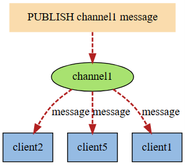

# Redis

## Redis 用处

基于内存，可持久化，键值对形式，包含String，List，Set，Sorted Set，Hash，Stream，LogLog，Bitmap

根据2-8原则，将20%的热点数据存储到Redis，对于一些实时性要求高的场景更优，比如点赞，排行。

## 数据类型

| 数据类型    | 描述                                                                 | col3 |
| ----------- | -------------------------------------------------------------------- | ---- |
| String      | 二进制安全的字符串                                                   |      |
| List        | 双向链表                                                             |      |
| Set         | 无序集合，底层是intset或hashtable                                    |      |
| Hash        | 键值对                                                               |      |
| Zset        | 有序集合                                                             |      |
| geo         | 地理空间                                                             |      |
| HyperLogLog | 基数统计，输入元素数量或体积非常大，<br />计算基数（去重数据量）较小 |      |
| bitmap      | 位图                                                                 |      |
| bitfield    | 一次性操作多个比特位                                                 |      |
| stream      | 流                                                                   |      |

## 键操作

16个库，默认使用第一个，select dbindex查看，move key dbindex 2 移动数据，select 3 切换至3号库

set 设置string，keys *查看所有键，dbsize查看key数量

flushdb 清空当前库，flushall 清空所有

命令不区分大小写，但key区分

### String

最大512M，set key value，get key

set 参数

- NX 键不存在时设置
- XX 键存在时设置
- GET 返回值改为原始值
- 过期时间 PX毫秒 EX秒 EXAT unix时间戳（秒）PXAT unix时间戳（毫秒）KEEPTTL
- TTL 修改时保留原过期时间（默认修改值时会重置过期时间）

mset mget，可批量添加获取键。msetnx，当键不存在时批量插入，原子操作，当部分键存在会导致所有插入失效

getrange：相当于substring，setrange，修改部分字符串，只需指定起始位置

incr|decr key [offset] 只能修改整型，浮点不行

setex key time value 设置键和过期时间，是原子操作，set 和 expire的结合

### List

最多2e23-1个元素，用于栈，队列，消息队列

lpush，rpush，lpop，rpop，lrange，没有rrange

lindex key index 获取指定元素 llen 获取长度

lrem key value num，从左删除等于指定值的num个元素

ltrim key start end，截取列表

lpoprpush source target 从source中弹出一个加入到target中

lset key index value，修改指定位置，没有rset

linsert key before|after prev new 在已有值的前后插入新值

### Hash

hset，hget，mhset，mhget，hlen

hgetall 获取所有键值对 hdel

hexists 判断是否存在键 hkeys hvals 获取键和值

hincrby hincrbyfloat 修改值

hsetnx 不存在时设置

### Set

sadd 添加 smembers 所有元素 srem 删除元素 scard 元素个数

srandmember 随机返回一个元素

spop 随机弹出一个元素

smove set1 set2 value 将存在于set1中的value存放到set2中

差集 sdiff 并集 sunion 交集 sinter 交集元素数 sintercard（用于去重统计）

### Zset

zadd key score value score相同时按value字母顺序排列

zrange start end [withscores] 输出全部 zrevrange 反转输出

 zrangebyscore key (score1 score2 [withscores] [limit num offset] 根据分数范围输出，左圆括号表示开区间（无论上限和下限），limit用法和mysql类似

zincrby 递增 zcount 分数范围计数

zrank 输出下标（正序）

### Bitmap

场景：链接有没有点击过，有没有签到

bitmap相当于string类型的子类，因为string底层就是二进制，bitmap是直接操纵bit位

setbit key offset 1|0  或 getbit key pos

strlen key 统计bitmap占了几个字节，超过8位后按字节扩容

bitcount 计数bitmap中1的个数

bitop operation

### HyperLogLog

统计UV (unique visiti)  每个HyperLogLog只要12KB内存，可以存2^64个不同基数，主要用于去重统计，误差为0.81%

PFADD key element 添加元素，常用为ip地址

pfcount 计数 pfmerge new hll1 hll2 将两个HyperLogLog合并

### GEO

geoadd key latitude1 longtitude1 name1 ...  添加经纬度，地理位置名称 ，相当于zset子类

geopos key name1 name2 返回经纬度

geohash key name1 name2 可生成base32编码值，将经纬度合并

geodist key name1 name2 km 返回两个位置的距离

georadius key latitude longtitude dist km [withdist] [withcoord] [withhash] [count n] [desc]

georadiusbymember 可将上述的经纬度替换为geo对象内的位置

### Stream


特殊符号： - + 最小和最大的ID，$ 消费新的消息，可用于将要到来的信息，> 用于xreadgroup，表示未发送给使用者的消息，会更新消费者组的最后ID， *用于xadd，让系统生成默认ID

| col1       | col2                                                        | col3                                                                                                                     |
| ---------- | ----------------------------------------------------------- | ------------------------------------------------------------------------------------------------------------------------ |
| xadd       | xadd key * k1 v1 k2 v2                                      | 向队列中添加消息，由多组键值对组成，ID需要递增                                                                           |
| xrange     | xrange key - +                                              | 显示队列中消息的范围                                                                                                     |
| xtrim      | xtrim key maxlen\|minid                                    | 根据最大长度或最小id截断stream，总是舍弃旧消息                                                                           |
| xread      | xread count num srteams key ID                              | 0, 0-0 表示最小id，\$表示当前最大id，可用于读取新消息，阻塞等待读                                                        |
| xgroup     | xgroup create key 0\|$                                      | 创建消费者组，0表示从头开始消费，\$表示从尾开始，即只消费后续新消息                                                      |
| xreadgroup | xreadgroup group gkey consumer1 streams skey [>\|count num] | 消费者读取消息，不限制时会读取全部消息，已读取的信息<br />不能被同组其他消费者读取，但可被其他组消费者读取 >表示读取全部 |
| xpending   | xpending gkey xkey [from to] [consumerkey]                  | 查询已读未签收                                                                                                           |
| xack       | xack xkey gkey ID                                           | 消费者组签收                                                                                                             |

已读未处理的消息：

```
xpending streamkey groupkey
1) (integer) 4        // 已读消息数
2) "1694147905046-0"  // 已读最小id
3) "1694147908682-0"  // 已读最大id
4) 1) 1) "cc1"
      2) "4"
```

### Bitfield

## 持久化

### RDB (Redis Database)

在经过指定时间间隔后将某一时刻的数据和状态作为快照记录到磁盘上 dump.rdb，恢复时直接读取至内存，备份文件应与redis服务器分开存储，恢复时只需要将rdb文件放在redis目录下

- 7之前保存频率为 save seconds changes 表示多少秒内发生多少次修改就保存
- 7之后可以设置多对 secondes changes，满足一个就保存
- 手动保存：save 和 bgsave，save会阻塞服务器，bgsave不会阻塞，原理是fork()一个子进程
- 优点：单文件单时间节点备份，恢复速度快，适合大规模数据恢复，使用LZF压缩，文件占用远小于内存占用
- 缺点：IO大，Redis意外停止会丢失部分数据，fork会导致内存用量翻倍
- 破损rdb文件修复：redis-check-rdb

主从复制，执行debug reload 重新加载redis，以及默认情况没开启AOF时都会触发bgsave

bgsave 本身不会阻塞主线程，但在创建子进程的过程中会阻塞，且占用内存越大阻塞时间越长。

### AOF（Append Only File）

将Redis的所有写命令以日志方式记录下来，只可追加不可修改，可根据日志文件appendonly.aof重新构建数据

- 当AOF文件过大时，会根据规则将命令合并即AOF重写
- 命令首先写入缓存，之后会写入AOF文件，有三种写回策略：always（IO过于频繁），everysec（默认），no（只写入缓存，由操作系统决定何时写入文件）
- 损坏aof文件修复：redis-check-aof --fix，一般只修改incr文件
- 优点：更持久，可以灵活设定，写入性能更好，因为是仅附加日志，不会出现严重的文件损坏
- 缺点：AOF通常比同等的RDB更大，恢复速度更慢，AOF可能更慢

#### AOF重写

当文件达到所设峰值时，自动重写AOF，只保留能恢复数据的最小指令集。直接读取服务器现有键值对，然后用一条命令代替之前记录的多条数据，生成新文件并替换原文件

### AOF + RDB

同时开启时，优先加载AOF文件。AOF负责增量持久化，RDB负责全量持久化

开启混合模式后，会同时读取两个文件。

## 事务

开启事务：multi

没有隔离级别的概念，不保证原子性，只有是否开始执行全部指令，保证所有指令顺序执行，且中间不会插入别的指令。即使客户端在事务执行期间断开，事务也会执行

| command    | col2                                                                   | col3   |
| ---------- | ---------------------------------------------------------------------- | ------ |
| multi      | 开启事务，接下来的命令只会记录不会执行                                 | queued |
| exec       | 执行前面记录的指令                                                     | ok     |
| discard    | 放弃执行前面的指令                                                     |        |
| watch keys | 添加乐观锁CAS，若加锁的键值在watch和exec之间发生了变化，则事务拒绝执行 |        |
| unwatch    | 解锁所有键值，在执行exec后，原加锁的也会自动解锁                       |        |

- 若记录的命令有错，即在exec前就检查出错误，exec会放弃执行所有命令
- 若在执行期间发生错误，redis事务不可回滚，会执行所有命令，即使是在错误发生后

## Redis底层结构


- type 包含对象类型，string list set zset hash
- encoding 是具体的编码信息，即对象具体保存的值的类型
- lru 是最后一次访问时间，或者lfu 最少使用的数据，当前时间减lru就是空转时间
- refcount 引用计数，为0时会被回收
- ptr 底层数据结构


### sds


头部sdshdr：len 字符串长度；alloc 除去\0后剩余的字节数，可以用uint8，uint16，uint32，uint64表示；flags 占一个字节，低三位表示头部类型

数据buf：buf数组以二进制保存数据，但不以\0判断末尾，而是以存储的长度。以\0为结尾是方便重用部分C标准库

空间预分配：在执行append操作时，redis会多分配一倍的使用空间，当使用空间大于1M时，只会多分配1M空间。当这些字符转持久化后再被读入redis，不会包含额外的空间

### 压缩列表 ziplist

ziplist是列表，但有特殊编码，整数内容不以字符串形式存储


* `zlbytes`字段的类型是uint32_t, 这个字段中存储的是整个ziplist所占用的内存的字节数
* `zltail`字段的类型是uint32_t, 它指的是ziplist中最后一个entry的偏移量. 用于快速定位最后一个entry, 以快速完成pop等操作
* `zllen`字段的类型是uint16_t, 它指的是整个ziplit中entry的数量. 这个值只占2bytes（16位）: 如果ziplist中entry的数目小于65535(2的16次方), 那么该字段中存储的就是实际entry的值. 若等于或超过65535, 那么该字段的值固定为65535, 但实际数量需要一个个entry的去遍历所有entry才能得到.
* `zlend`是一个终止字节, 其值为全F, 即0xff. ziplist保证任何情况下, 一个entry的首字节都不会是255

ziplist 通过编码使得每个节点会根据存储的内容不同而分配不同的空间，尽量按照实际大小存储，为了解决遍历增加了 `prelen` 字段。但也正因为如此，每次节点扩容都会导致内存增长，而且扩容的内容超过254字节，会导致后续节点的 `prelen` 从1字节扩容到5字节，这可能导致链式扩容，可能是 O(n) 复杂度。但通常概率较小。在计算出最终需要的容量后，通过 `memmove` 操作可内存重分配。

### 快表 QuickList


* `quicklistNode`, 宏观上, quicklist是一个链表, 这个结构描述的就是链表中的结点. 它通过zl字段持有底层的ziplist. 简单来讲, 它描述了一个ziplist实例
* `quicklistLZF`, ziplist是一段连续的内存, 用LZ4算法压缩后, 就可以包装成一个quicklistLZF结构. 是否压缩quicklist中的每个ziplist实例是一个可配置项. 若这个配置项是开启的, 那么quicklistNode.zl字段指向的就不是一个ziplist实例, 而是一个压缩后的quicklistLZF实例
* `quicklistBookmark`, 在quicklist尾部增加的一个书签，它只有在大量节点的多余内存使用量可以忽略不计的情况且确实需要分批迭代它们，才会被使用。当不使用它们时，它们不会增加任何内存开销。
* `quicklist`. 这就是一个双链表的定义. head, tail分别指向头尾指针. len代表链表中的结点. count指的是整个quicklist中的所有ziplist中的entry的数目. fill字段影响着每个链表结点中ziplist的最大占用空间, compress影响着是否要对每个ziplist以LZ4算法进行进一步压缩以更节省内存空间.
* `quicklistIter`是一个迭代器
* `quicklistEntry`是对ziplist中的entry概念的封装. quicklist作为一个封装良好的数据结构, 不希望使用者感知到其内部的实现, 所以需要把ziplist.entry的概念重新包装一下.

quicklist有自己的优点, 也有缺点, 对于使用者来说, 其使用体验类似于线性数据结构, list作为最传统的双链表, 结点通过指针持有数据, 指针字段会耗费大量内存. ziplist解决了耗费内存这个问题. 但引入了新的问题: 每次写操作整个ziplist的内存都需要重分配. quicklist在两者之间做了一个平衡. 并且使用者可以通过自定义 `quicklist.fill`, 根据实际业务情况, 经验主义调参.

### 字典/哈希表 - Dict

值是 `dictEntry` ，保存键，值（int64_t 或 uint64_t)，以及指向下一个节点的指针，用于链式地址法解决冲突

* **解决哈希冲突** ：这个问题上面我们介绍了，方法是链地址法。通过字典里面的 *next 指针指向下一个具有相同索引值的哈希表节点。
* **扩容和收缩** ：当哈希表保存的键值对太多或者太少时，就要通过 rerehash(重新散列）来对哈希表进行相应的扩展或者收缩。具体步骤：

1. 如果执行扩展操作，会基于原哈希表创建一个大小等于 ht[0].used*2n 的哈希表（也就是每次扩展都是根据原哈希表已使用的空间扩大一倍创建另一个哈希表）。相反如果执行的是收缩操作，每次收缩是根据已使用空间缩小一倍创建一个新的哈希表。
2. 重新利用上面的哈希算法，计算索引值，然后将键值对放到新的哈希表位置上。
3. 所有键值对都迁徙完毕后，释放原哈希表的内存空间。

* **触发扩容的条件** ：

1. 服务器目前没有执行 BGSAVE 命令或者 BGREWRITEAOF 命令，并且负载因子大于等于1。
2. 服务器目前正在执行 BGSAVE 命令或者 BGREWRITEAOF 命令，并且负载因子大于等于5。

ps：负载因子 = 哈希表已保存节点数量 / 哈希表大小。

* **渐近式 rehash**

什么叫渐进式 rehash？也就是说扩容和收缩操作不是一次性、集中式完成的，而是分多次、渐进式完成的。如果保存在Redis中的键值对只有几个几十个，那么 rehash 操作可以瞬间完成，但是如果键值对有几百万，几千万甚至几亿，那么要一次性的进行 rehash，势必会造成Redis一段时间内不能进行别的操作。所以Redis采用渐进式 rehash,这样在进行渐进式rehash期间，字典的删除查找更新等操作可能会在两个哈希表上进行，第一个哈希表没有找到，就会去第二个哈希表上进行查找。但是进行 增加操作，一定是在新的哈希表上进行的。

### IntSet


1. `encoding` 表示编码方式，的取值有三个：INTSET_ENC_INT16, INTSET_ENC_INT32, INTSET_ENC_INT64
2. `length` 代表其中存储的整数的个数
3. `contents` 指向实际存储数值的连续内存区域, 就是一个数组；整数集合的每个元素都是 contents 数组的一个数组项（item），各个项在数组中按值得大小 **从小到大有序排序** ，且数组中不包含任何重复项。（虽然 intset 结构将 contents 属性声明为 int8_t 类型的数组，但实际上 contents 数组并不保存任何 int8_t 类型的值，contents 数组的真正类型取决于 encoding 属性的值）

当向一个 int16_t 类型的数组插入 int32_t 类型的元素时，会导致数组升级：

- 首先根据新类型计算并扩充空间
- 将原数组元素转换为新类型，并放置在正确的位置上，保证原顺序
- 改变encoding，长度+1

### ZSkipList

普通链表


跳表


* `ele`字段，持有数据，是sds类型
* `score`字段, 其标示着结点的得分, 结点之间凭借得分来判断先后顺序, 跳跃表中的结点按结点的得分升序排列.
* `backward`指针, 这是原版跳跃表中所没有的. 该指针指向结点的前一个紧邻结点.
* `level`字段, 用以记录所有结点(除过头节点外)；每个结点中最多持有32个zskiplistLevel结构. 实际数量在结点创建时, 按幂次定律随机生成(不超过32). 每个zskiplistLevel中有两个字段
  * `forward`字段指向比自己得分高的某个结点(不一定是紧邻的), 并且, 若当前zskiplistLevel实例在level[]中的索引为X, 则其forward字段指向的结点, 其level[]字段的容量至少是X+1. 这也是上图中, 为什么forward指针总是画的水平的原因.

## Redis 数据类型与底层实现的关系

### SDS

- int：保存long类型的整数值时
- embstr：保存长度小于44字节的字符串，字符串与redisObject内存空间连续，只需一次分配，但长度增加需要重新分配内存时，redisObject也需要重新分配
- raw：保存大于44字节的字符串，需两次分配


### List

List 使用 QuickList 实现，ptr 指向QuickList 头

### Hash

哈希对象底层为 ziplist 或 hashtable，当底层为 hashtable 时，ht数组可能指向两个 dictht 实例。使用ziplist时，新元素总是添加到队尾。

当元素个数小于512个，且每个元素长度小于64字节时，使用 ziplist，这两个限值可以在配置文件中修改


### Set

集合的编码可以是 intset 和 hashtable，使用 intset 时元素只能为整数

当元素个数不超过512且都是整数时使用 intset，其他时候使用 hashtable，且值字段闲置不用

### ZSet

有序集合的底层一种为 ziplist，一种为 dict 和 skiplist的结合


## 发布订阅模式

Redis 的发布订阅模式可以让客户端订阅任意数量的频道



发布

```
> publish channel message
```

订阅

```
> subscribe channels
Reading messages... (press Ctrl-C to quit)
```

订阅频道不会收到订阅前的消息

在订阅状态下，客户端只能使用 `subscribe`, `unsubscribe`, `psubscribe` 和 `punsubscribe` 命令。

### 基于模式的发布订阅 psubscribe

可以使用模式匹配来堆多个频道发布消息，如 `tweet.shop.*` 匹配 `tweet.shop.kindle` 和 `tweet.shop.ipad`，且 `tweet.shop.*`也可作为一个频道被订阅，会同时收到单独发给另两个频道的消息。?匹配任意一个字符，\*匹配任意个字符 ，?\*匹配任意一个以上的字符


### 订阅底层实现

订阅机制底层是通过字典实现的，键为channel名，值为链表，包含订阅这个频道的客户端


基于模式的订阅机制维护一个节点为 pubsubPattern 的链表，包含客户端名和模式信息 client, pattern。当调用 psubscribe 时，会创建一个 pubsubPattern 节点添加到链表中。

## Redis 事件

事件驱动库只关注网络IO以及定时器，主要处理 Redis 服务器和客户端之间的网络 IO，以及些定时操作。

- file event：处理网络IO
- time event：如 serverCron 函数，需要在给定时间点执行。


#### 文件事件

##### 网络事件处理

基于 Reactor 模型，文件事件处理器采用 IO 多路复用技术，同时监听多个套接字，并为其关联不同的事件处理函数。当套接字可读或可写事件触发时，会调用相应处理函数。

##### 事件响应框架 ae_event 及文件事件处理器

Redis 使用的IO多路复用技术主要有 select，epoll，evport 和 kqueue。会根据不同操作系统以及不同优先级选择不同的多路复用技术。事件响应框架一般都采用该架构，如 netty 和 libevent。

文件事件是对套接字操作的抽象，当一个套接字准备 `accept, read, write, close` 时，会产生文件事件。Redis 通常会连接多个套接字，所以会出现并发出现多个文件事件。IO 多路复用程序会监听多个套接字，并向文件事件派发器传递产生事件的套接字。IO 多路复用程序会将产生的套接字放在同一个队列中（fired）。然后文件事件处理器会以同步方式单个处理队列中的套接字。

一次客户端与服务器连接且发送命令的过程：

* 客户端向服务器发起**建立 socket 连接的请求**，监听套接字会产生 `AE_READABLE` 事件，触发连接应答处理器执行。处理器会**应答**客户端的请求，然后创建客户端套接字，以及客户端状态，将客户端套接字的 `AE_READABLE` 世家与命令请求处理器关联。
* 连接后，客户端向服务器**发送命令**，服务器中客户端套接字会产生 `AE_READABLE` 事件，触发命令请求处理器执行，处理器读取客户端命令，然后传递给相关程序去执行。
* 服务器将客户端套接字的 `AE_WRITEABLE` 事件与命令回复器相关联。当客户端试图读取命令回复时，客户端产生 `AE_WRITEABLE` 事件，触发命令回复处理器将命令回复写入套接字中。

##### Redis IO 多路复用

Redis 的多路复用机制允许内核中同时存在多个监听套接字和已连接套接字。内核会一直监听连接请求或数据请求。当select/epoll 提供了事件回调机制，即根据不同的事件调用相应的处理函数。当 select/epoll 检测到 FD（套接字）上有请求时，会触发相应的事件。这些事件会被放入一个事件队列，Redis 单线程会不断处理这个队列。这样 Redis 不用轮询是否有请求，可避免CPU资源浪费。


### 时间事件

时间事件分为定时事件和周期性事件

```C
typedef struct aeTimeEvent {
    /* 全局唯一ID */
    long long id; /* time event identifier. */
    /* 秒精确的UNIX时间戳，记录时间事件到达的时间*/
    long when_sec; /* seconds */
    /* 毫秒精确的UNIX时间戳，记录时间事件到达的时间*/
    long when_ms; /* milliseconds */
    /* 时间处理器 */
    aeTimeProc *timeProc;
    /* 事件结束回调函数，析构一些资源*/
    aeEventFinalizerProc *finalizerProc;
    /* 私有数据 */
    void *clientData;
    /* 前驱节点 */
    struct aeTimeEvent *prev;
    /* 后继节点 */
    struct aeTimeEvent *next;
} aeTimeEvent;
```

一个事件是定时还是周期事件取决于事件处理器的返回值。`AE_NOMORE` 表示定时事件，到达后删除，不会再重复。非 `AE_NOMORE` 表示为周期事件，事件到达后，会根据事件处理器的返回值对时间事件的 when 属性更新，让这个事件过一段时间后再次到达。

服务器所有时间事件放在一个无序链表中，当时间事件执行器运行时，遍历链表查找所有到达时间事件，并调用相应处理器。正常模式下服务器只使用 serverCron 一个时间事件，在 benchmark 模式下也只使用两个时间事件，所以不影响事件执行的性能。

### aeEventLoop

Redis 服务器在初始化时，会创建事件处理器 aeEventLoop 对象。

## Redis 主从复制 - 高可用

主从复制的作用是

* **数据冗余** ：主从复制实现了数据的热备份，是持久化之外的一种数据冗余方式。
* **故障恢复** ：当主节点出现问题时，可以由从节点提供服务，实现快速的故障恢复；实际上是一种服务的冗余。
* **负载均衡** ：在主从复制的基础上，配合读写分离，可以由主节点提供写服务，由从节点提供读服务（即写Redis数据时应用连接主节点，读Redis数据时应用连接从节点），分担服务器负载；尤其是在写少读多的场景下，通过多个从节点分担读负载，可以大大提高Redis服务器的并发量。
* **高可用基石** ：除了上述作用以外，主从复制还是哨兵和集群能够实施的基础，因此说主从复制是Redis高可用的基础。

主从库之间采用的是**读写分离**的方式。

* 读操作：主库、从库都可以接收；
* 写操作：首先到主库执行，然后，主库将写操作同步给从库。

主从复制

- 全量（同步）复制：第一次同步时
- 增量（同步）复制：只会把主从库网络断连期间主库收到的命令，同步给从库

### 全量复制

建立主从关系：在从库上执行 replicaof main_ip port

全量复制三阶段

- 从库向主库发送 psync 命令，主库根据参数开启复制。参数包括 runID 和 复制进度 offset。runID 时 Redis 实例ID，offset 在第一次时设置为 -1 。主库在收到 psync 后会用 FULLRESYNC 响应，参数为 主库 runID 和主库复制进度 offset。FULLRESYNC 表示全量复制。
- 主库将数据同步至从库，从库依据主库的RDB文件加载数据。主库执行 bgsave，生成 RDB 文件发送至从库，从库会清空数据库并加载 RDB 文件。为保证数据一致性，主库在生成 RDB 文件时会使用 replication buffer 记录 RDB 文件生成后的所有写操作。
- 主库将第二阶段执行过程中的新命令发送至从库，即 replication buffer 中的修改操作。


### 增量复制

如果主从库在传输命令时出现网络闪断，每次都全量复制开销过大，因此有增量复制的方式。

`repl_backlog_buffer`：它是为了从库断开之后，如何找到主从差异数据而设计的环形缓冲区，从而避免全量复制带来的性能开销。如果从库断开时间太久，repl_backlog_buffer环形缓冲区被主库的写命令覆盖了，那么从库连上主库后只能乖乖地进行一次全量复制，所以 **repl_backlog_buffer配置尽量大一些，可以降低主从断开后全量复制的概率** 。而在repl_backlog_buffer中找主从差异的数据后，如何发给从库呢？这就用到了replication buffer。

`replication buffer`：Redis和客户端通信也好，和从库通信也好，Redis都需要给分配一个 内存buffer进行数据交互，客户端是一个client，从库也是一个client，我们每个client连上Redis后，Redis都会分配一个client buffer，所有数据交互都是通过这个buffer进行的：Redis先把数据写到这个buffer中，然后再把buffer中的数据发到client socket中再通过网络发送出去，这样就完成了数据交互。所以主从在增量同步时，从库作为一个client，也会分配一个buffer，只不过这个buffer专门用来传播用户的写命令到从库，保证主从数据一致，我们通常把它叫做replication buffer。

恢复连接时，从库通过 psync 命令将自己的offset发送给主库，主库会判断是否需要全量复制。

### 其他内容

主服务器需要开启持久化，否则当主库重启时会变成空数据库，同时也会同步至从库，导致从库变空。

全量复制使用 RDB，因为 RDB 较小，且从库加载更快。使用 AOF 会需要主库开启 AOF，可能导致性能问题。

无磁盘复制：如果磁盘速度较低，将 RDB 文件从磁盘发送至从库太耗时，会影响主服务器。无磁盘复制可以直接生成 RDB 并发送至从库。

主-从-从模式：如果主库连接多个从库，且从库都和主库全量复制，会导致主库忙于生成 RDB 文件，同时也会占用过多网络带宽。

### 读写分离

主节点提供写服务，多个从节点提供读服务。

#### 延迟问题

由于主从复制的命令是异步的，延迟和数据不一致在所难免。如果对数据一致性的要求较高，可以优化网络环境，监控主从节点延迟（offset），如果延迟过大，则不从此节点读数据。如果出现了网络闪断等严重的不一致问题，从节点的 slave-serve-stale-data 参数会控制此时从节点应有的表现。yes 表示还能接受客户端请求，no 表示只能响应少量命令。

#### 数据过期问题

单机版 Redis 有惰性删除和定期删除两种策略。在主从复制场景下，为了保证数据一致性，只有主节点会删除数据。但由于两种删除策略都不能保证从节点及时删除，新版本 Redis 增加了过期判断。

#### 故障切换

没有哨兵的读写分离场景下，如果 Redis 节点出现问题，应用和 Redis 节点的连接应切换。不论是手动还是自动检测，成本都较高。

## 哨兵机制 - 高可用


* **监控（Monitoring）** ：哨兵会不断地检查主节点和从节点是否运作正常。
* **自动故障转移（Automatic failover）** ：当主节点不能正常工作时，哨兵会开始自动故障转移操作，它会将失效主节点的其中一个从节点升级为新的主节点，并让其他从节点改为复制新的主节点。
* **配置提供者（Configuration provider）** ：客户端在初始化时，通过连接哨兵来获得当前Redis服务的主节点地址。
* **通知（Notification）** ：哨兵可以将故障转移的结果发送给客户端。

### 哨兵集群组建

哨兵集群通过发布订阅机制组建，主库中有一个 `__sentinel__:hello` 频道，用于哨兵互相发现和通信。每个哨兵将自己的 ip 端口号发布到频道上，其他哨兵订阅可获得此消息。然后不同哨兵相互建立网络连接。

### 哨兵监控 Redis

哨兵向主库发送 INFO 命令，主库接收到后会把从库列表返回给哨兵，哨兵根据此信息和所有从库建立连接，并持续监控。

#### Redis 主库下线的判定

* **主观下线** ：任何一个哨兵都是可以监控探测，并作出Redis节点下线的判断；
* **客观下线** ：有哨兵集群共同决定Redis节点是否下线；

当某个哨兵判断主库主管下线时，会给其他哨兵发送 `is-master-down-by-addr` 命令。其他哨兵会根据自己的连接回复相应。如果赞成下线的哨兵数大于等于配置中的 `quorum`，则判断主库客观下线。

#### 哨兵集群的选举

当判断主库下线后，需要有一个哨兵完成主从切换。Redis 使用 Raft 算法来选举成为leader的哨兵，要求投票超过半数且超过配置的 `quorum` 值。

若主库下线，且五个哨兵中有三个故障，`quorum` 设置为2，则能完成客观下线，但不能自动切换。

#### 新主库的选择

* 过滤掉不健康的（下线或断线），没有回复过哨兵ping响应的从节点
* 选择 `salve-priority`从节点优先级最高（redis.conf）的
* 选择复制偏移量最大，只复制最完整的从节点

故障转移流程


## Cluster 分片技术 - 高拓展

只使用哨兵机制，只会有一个主库，如果主库出现问题，在主从切换时将会无法接受所有写操作。集群可以使多个 Redis 节点共享数据，可支持多个主库。Cluster 自带哨兵机制，无需单独配置。

 **可接受的写入安全**：系统尝试(采用best-effort方式)保留所有连接到master节点的client发起的写操作。通常会有一个小的时间窗，时间窗内的已确认写操作可能丢失(即，在发生failover之前的小段时间窗内的写操作可能在failover中丢失)。而在(网络)分区故障下，对少数派master的写入，发生写丢失的时间窗会很大。不保证数据的强一致性。

 **可用性** ：Redis Cluster在以下场景下集群总是可用：大部分master节点可用，并且对少部分不可用的master，每一个master至少有一个当前可用的slave。更进一步，通过使用 replicas migration 技术，当前没有slave的master会从当前拥有多个slave的master接受到一个新slave来确保可用性。

### 哈希槽

集训键空间被分为16384槽，理论上每个槽都可配置一个节点，但建议最高1000个节点。`HASH_SLOT = CRC16(key) mod 16384`。然后使用确定性哈希算法，确定数据存储在哪个分片上。哈希槽方便扩容和缩容。

#### Hash tag

为了将相关的 key 分配到相同的哈希槽中，Redis 支持使用 tags 。如 {user1000}.following 和 {user1000}.followers 这两个键都会使用 user1000 来计算哈希槽值。只有从左往右第一个{}中的内容会被用作 hash tag，如果含有空{}，则不会启用 hash tag，有多个只会匹配第一个。

#### 其他哈希

哈希取余分区：根据 `hash(key)%N` 来确定数据存放在哪个节点上。简单有效，但每次扩容缩容时会导致映射关系需要重新计算。

一致性哈希算法：

- 哈希环：计算哈希值映射到2^32个桶的环形区间上。


- IP 节点映射：对IP计算哈希值，同样可以落在哈希环上，将此位置到下一个节点 IP 对应的位置的哈希值存放在此节点上。


- 容错性和扩张性：节点的加入和删除只影响相邻节点。
- 数据倾斜问题：节点较少时，可能节点 IP 在环上的位置相近，导致数据大量存储在同一节点上，数据分布不均匀。

#### 哈希槽分区

可以解决数据分配的问题，由集群记录槽和节点的映射关系：用 char 进行位图压缩。

为什么是 16384 个槽：

- 槽位是65536时，发送心跳信息的消息头会达到8k，而16384只需要2k。slot_num / 8 / 1024 = 8kb
- 集群节点越多，心跳包的消息携带数据越多。如果节点超过1000，会导致网络拥堵。

为什么在集群模式下不建议使用发布订阅：

- 在集群模式下所有 publish 命令都会向所有节点广播，加重带宽负担。

### Cluster nodes 属性

每个节点在集群中有一个唯一固定的名字，由160bit随机十六进制数字表示，在第一次启动时获得。节点会将ID保留在配置文件中，并一直使用。节点可以改变 IP port 而不会改变 ID。集群可以检测 IP port 的变动并通过 gossip 协议重新配置。

每个节点维护其他节点的 `node id`, `节点的IP和port`，`节点标签`，`master node id`（如果这是一个slave节点），`最后被挂起的ping的发送时间`(如果没有挂起的ping则为0)，`最后一次收到pong的时间`，`当前的节点configuration epoch` ，`链接状态`，以及最后是该节点服务的 `hash slots`。

cluster node 命令可以查看该节点视角下对集群状态和每个节点的信息，以及连接信息

### Cluster 总线

每个节点有一个额外的 TCP 端口来连接其他节点，通常为命令端口加10000，此端口只用于集群总线协议。

### 集群拓扑

每个节点都与其他所有节点保持TCP连接。在一个由N个节点的集群中，每个节点都有N-1个传出和传入连接，这些连接永远保持活性。当一个节点在总线上发出 ping 请求，如果在指定时间内没有得到回复，在标记对方为不可达之前，首先尝试重新连接。在全网拓扑的节点中，使用 gossip 协议和配置更新机制来避免在正常情况下节点之间交换太多信息，因此交换的信息数不是指数级的。

### 节点握手

节点总是接受总线端口的连接，且总是回复ping请求，若发送节点不被认为是集群的一部分，其他请求都会被抛弃。一个节点被其他节点认为是集群的一部分有两种方式：

1. 一个节点在 MEET 消息中。MEET 消息和ping类似，会让接收指令的节点接受一个节点为集群的一部分。MEET 消息需要管理员向节点发送 `cluster meet ip port` 。
2. 一个被信任的节点A gossip 另一个节点B，接收 gossip 消息的节点C也会将那个节点B认为是集群的一部分。

### 请求重定向

Redis 集群采用去中心化架构，客户端请求某个 key 时，节点对请求的处理过程如下：

* 检查当前key是否存在当前NODE？
  * 通过crc16（key）/16384计算出slot
  * 查询负责该slot负责的节点，得到节点指针
  * 该指针与自身节点比较
* 若slot不是由自身负责，则返回MOVED重定向
* 若slot由自身负责，且key在slot中，则返回该key对应结果
* 若key不存在此slot中，检查该slot是否正在迁出（MIGRATING）？
* 若key正在迁出，返回ASK错误重定向客户端到迁移的目的服务器上
* 若Slot未迁出，检查Slot是否导入中？
* 若Slot导入中且有ASKING标记，则直接操作
* 否则返回MOVED重定向

MOVED 重定向：槽不命中，节点会向客户端返回 MOVED 重定向，客户端根据重定向包含的内容寻找目标节点，再次发送请求。配置了集群时，重定向由集群得出，没有配置时需要手动编写寻找节点的逻辑。

ASK 重定向：集群伸缩时会导致槽迁移，去原节点访问时数据可能已经迁移到目标节点，ASK 重定向可以发送新节点位置。

#### smart 客户端

使用重定向机制来寻找正确的节点过于复杂，smart 客户端内部会维护一个 key->slot->node 的映射关系，用于快速定位节点。


### 状态检测及维护

#### Gossip 协议（epidemic 协议）

gossip 协议保证分布式系统最终一致性。在一个有界网络中，每个节点都与几个邻居节点通信，经过一段时间后所有节点的状态都达成一致。

集群中的消息类型：

* `Meet` 通过「cluster meet ip port」命令，已有集群的节点会向新的节点发送邀请，加入现有集群。
* `Ping` 节点每秒会向集群中其他节点发送 ping 消息，消息中带有自己已知的两个节点的地址、槽、状态信息、最后一次通信时间等。
* `Pong` 节点收到 ping 消息后会回复 pong 消息，消息中同样带有自己已知的两个节点信息。
* `Fail` 节点 ping 不通某节点后，会向集群所有节点广播该节点挂掉的消息。其他节点收到消息后标记已下线。

#### 基于Gossip的故障检测

每个节点会定期向其他节点发送 ping 消息，交换各个节点状态信息，检测各个节点：**在线状态** 、 **疑似下线状态PFAIL** 、 **已下线状态FAIL** 。

**本节点保存信息：**主节点A通过消息得知主节点B认为主节点D进入疑似下线（PFAIL）状态，主节点A在 clusterState.nodes 字典中找到D对应的clusterNode结构，并将主节点B的下线报告添加到clusterNode结构的fail_reports链表中，并后续关于结点D疑似下线的状态通过Gossip协议通知其他节点。

**一起裁定：**如果集群里面，半数以上的主节点都将主节点D报告为疑似下线，那么主节点D将被标记为已下线(FAIL)状态，将主节点D标记为已下线的节点会向集群广播主节点D的FAIL消息，所有收到FAIL消息的节点都会立即更新nodes里面主节点D状态标记为已下线。

 **最终裁定：**将 node 标记为 FAIL 需要满足以下两个条件：

* 有半数以上的主节点将 node 标记为 PFAIL 状态。
* 当前节点也将 node 标记为 PFAIL 状态。

#### 心跳时间

节点会记录每个节点上次发出ping和收到pong的时间，保证心跳间隔不会太长也不会太频繁：

* 每次 Cron 向所有未建立连接的节点发送 ping 或 meet
* 每秒从已知节点中随机选取5个，向其中上次收到 pong 最久远的发送 ping
* 每次 Cron 向收到 pong 超过 `timeout/2` 的节点发送 ping
* 收到 ping 或 meet，立即回复pong

cron 表达式是用于定时任务，主要包含的是时间信息。

#### 心跳内容

Header：

* 所负责 slots 的信息
* 主从信息
* IP port 信息
* 状态信息

Gossip：

* ping_sent，pong_received
* ip port 信息
* 状态信息，比如 pfail，fail

#### 如何处理心跳信息

##### 新节点

发送 meet 包加入集群，在pong包中gossip其他节点，直到所有节点都知道加入集群

##### slot 信息

判断发送者 slot 信息异同，发送者 epoch 大则更新自己，否则通知发送者更新。

##### 主从节点信息

根据发送者主从节点信息更新自己的信息

##### 节点 fail 探测

pong 超时则标记为 pfail，用 gossip 传播pfail，检测 pfail，并维护其他节点的 pfail 投票记录，发现投票超过半数则标记为fail，并广播 fail

每个心跳包中包含多个 gossip 包，Redis 选择每个心跳包包含 N/10 个 gossip 包，保证在 pfail 过期时间内能接收到80%的节点的gossip投票，保证能顺利判断 fail。

### 故障恢复 failover

当slave发现自己的master变为FAIL状态时，便尝试进行Failover，以期成为新的master。由于挂掉的master可能会有多个slave。Failover的过程需要经过类Raft协议的过程在整个集群内达到一致， 其过程如下：

* slave发现自己的master变为FAIL
* 将自己记录的集群currentEpoch加1，并广播Failover Request信息
* 其他节点收到该信息，只有master响应，判断请求者的合法性，并发送FAILOVER_AUTH_ACK，对每一个epoch只发送一次ack
* 尝试failover的slave收集FAILOVER_AUTH_ACK
* 超过半数后变成新Master
* 广播Pong通知其他集群节点


### 扩容缩容

#### 扩容

当集群出现容量限制或者其他一些原因需要扩容时，redis cluster提供了比较优雅的集群扩容方案。

1. 首先将新节点加入到集群中，可以通过在集群中任何一个客户端执行cluster meet 新节点ip:端口，或者通过redis-trib add node添加，新添加的节点默认在集群中都是主节点。
2. 迁移数据 迁移数据的大致流程是，首先需要确定哪些槽需要被迁移到目标节点，然后获取槽中key，将槽中的key全部迁移到目标节点，然后向集群所有主节点广播槽（数据）全部迁移到了目标节点。直接通过redis-trib工具做数据迁移很方便。 现在假设将节点A的槽10迁移到B节点，过程如下：

```bash
B:cluster setslot 10 importing A.nodeId
A:cluster setslot 10 migrating B.nodeId
```

循环获取槽中key，将key迁移到B节点

```bash
A:cluster getkeysinslot 10 100
A:migrate B.ip B.port "" 0 5000 keys key1[ key2....]
```

向集群广播槽已经迁移到B节点

```bash
cluster setslot 10 node B.nodeId
```

#### 缩容

缩容的大致过程与扩容一致，需要判断下线的节点是否是主节点，以及主节点上是否有槽，若主节点上有槽，需要将槽迁移到集群中其他主节点，槽迁移完成之后，需要向其他节点广播该节点准备下线（cluster forget nodeId）。最后需要将该下线主节点的从节点指向其他主节点，当然最好是先将从节点下线

## Redis 缓存问题

### 缓存击穿

指访问数据库中存在但Redis中不存在的数据。一般由于缓存时间到期，并发用户同时访问一条数据，读缓存时没有命中，需要同时访问数据库。

解决方案：

- 热点数据永不过期
- 接口限流与熔断，降级。重要的接口一定要做好限流策略，防止用户恶意刷接口，同时要降级准备，当接口中的某些 服务 不可用时候，进行熔断，失败快速返回机制。
- 互斥锁

### 缓存穿透

指访问数据库和 Redis 中都不存在的数据。这种请求会导致 Redis 永远不命中，一直需要访问数据库。如果有恶意攻击，会导致数据库崩溃。

解决方案：

- 接口层添加校验，如用户鉴权，id校验，拦截 id<=0 的请求。
- 数据库中也不存在的数据，可以在Redis中设置 key - null，设置较短的有效时间（30s），防止一直攻击同一个 id
- 布隆过滤器：快速判断一个 key 是否存在，不存在直接返回。

### 缓存雪崩

指缓存中大批数据到期，而查询数据量巨大，引起数据库崩溃。

解决方案：

- 过期时间设置为随机，防止同一时间大量数据过期
- 如果有分布式架构，将热点数据均匀分布在不同 Redis 节点中
- 热点数据永不过期

### 缓存污染

指缓存中存在一些只访问很少的数据，不会有新访问但仍留存在缓存中，消耗空间。随着服务时间推移，这种数据可能越来越多，影响性能。

#### 设置最大缓存

大容量缓存的成本较高，通常设置为总数据量的 15% 到 30%。

#### 缓存淘汰策略

Redis 有八种淘汰策略，分别是 noeviction、volatile-random、volatile-ttl、volatile-lru、volatile-lfu、allkeys-lru、allkeys-random 和 allkeys-lfu 策略。

### 数据一致性

当更新数据时，不管是先更新 Redis 还是先更新数据库，都有可能出现数据不一致的问题。

1. 如果删除了缓存Redis，还没有来得及写库MySQL，另一个线程就来读取，发现缓存为空，则去数据库中读取数据写入缓存，此时缓存中为脏数据。
2. 如果先写了库，在删除缓存前，写库的线程宕机了，没有删除掉缓存，则也会出现数据不一致情况。

## BigKey

### 批量导入大量数据

```bash
bash for((i=1; i<=100*10000; i++)); do echo "set k$i v$i" >> /tmp/redisTest.txt; done;

cat /tmp/redisTest.txt | redis-cli -h 127.0.0.1 -p 6379 --pipe
```

此时 keys * 会返回大量数据，只能使用 dbsize 查看键数量，可以在配置文件中禁用命令keys，flushdb，flushall：rename-command keys ""

### 遍历键

`SCAN cursor [MATCH pattern] [COUNT count]` 基于游标的迭代器，每次都会返回更新的游标，下次调用时需要上次的游标。

```bash
127.0.0.1:6379> scan 0 match * count 10
1) "851968"
2)  1) "k173217"
    2) "k944989"
    3) "k278208"
    4) "k150805"
    5) "k391770"
    6) "k611182"
    7) "k731357"
    8) "k617766"
    9) "k171003"
   10) "k516382"
127.0.0.1:6379> scan 851968 match * count 10
1) "163840"
2)  1) "k996141"
    2) "k909587"
    3) "k193641"
    4) "k978860"
    5) "k147592"
    6) "k491277"
    7) "k648097"
    8) "k249587"
    9) "k294834"
   10) "k366962"
```

### BigKey 案例

非字符串的 bigkey，不能使用 del 删除，要使用 scan 渐进删除。string 超过10KB，list、hash、set、zset元素超过5000个就算 bigkey。容易造成缓存负载不均衡。

查询 bigkey：--bigkey。检查每种数据结构的 bigkey。为防止影响太大，-i 参数可以选择每次扫描间休眠一定时间。

```shell
redis-cli -h {ip} -p {port} --bigkeys -i {sec}
```

查询 key 占用字节数：memory usage key
