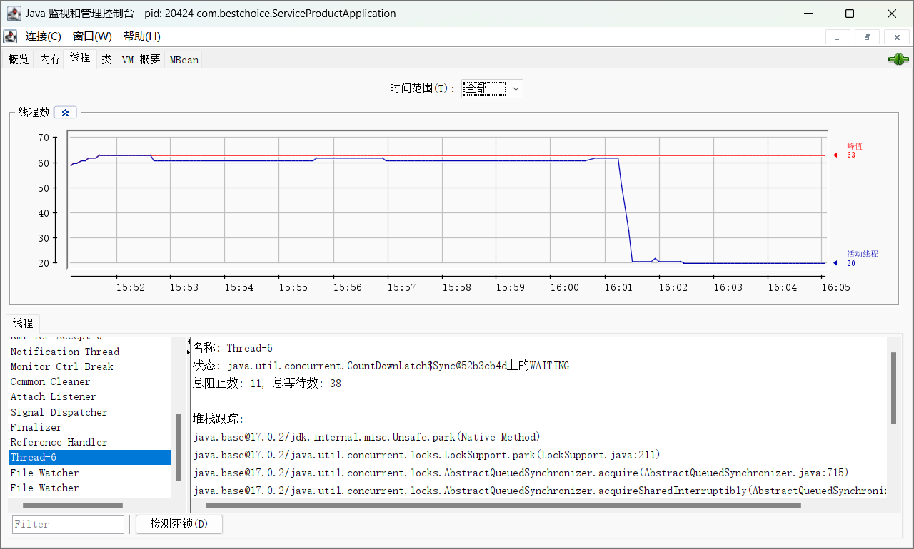
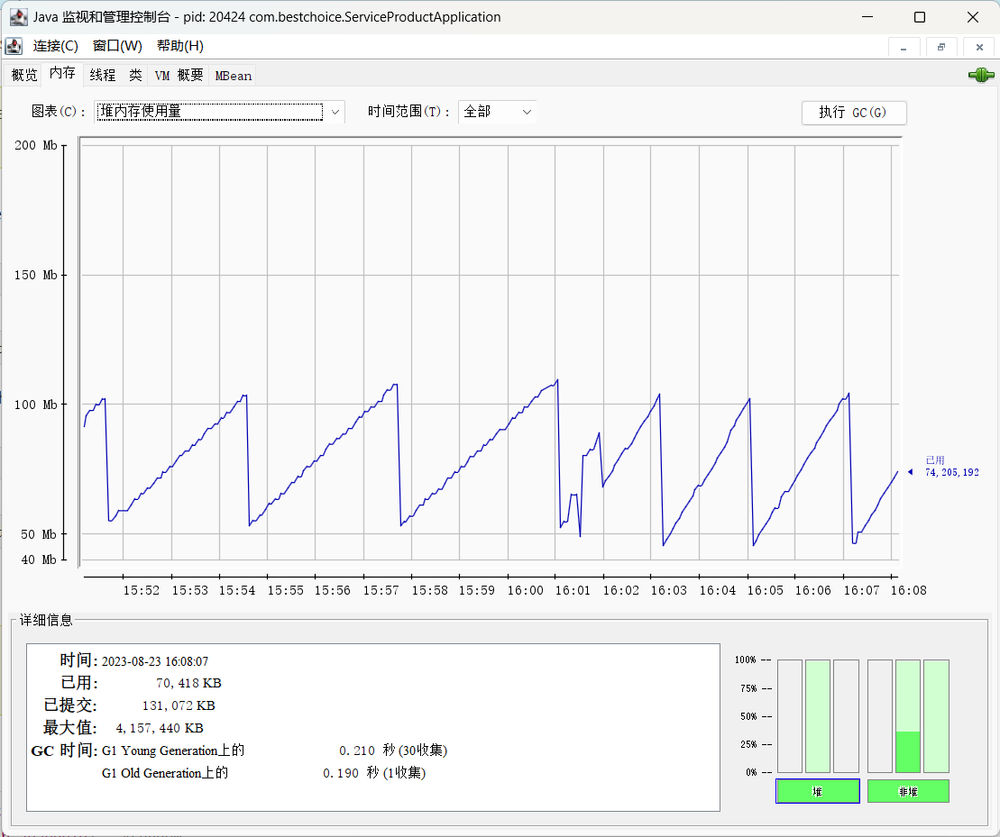

# 异常重启

## 日志信息

```
2023-08-23 15:50:39.323  INFO 20424 --- [  restartedMain] c.bestchoice.ServiceProductApplication   : Started ServiceProductApplication in 13.226 seconds (JVM running for 14.389)
2023-08-23 15:50:39.672 DEBUG 20424 --- [on(8)-10.1.1.94] o.s.c.e.PropertySourcesPropertyResolver  : Found key 'local.server.port' in PropertySource 'server.ports' with value of type Integer
2023-08-23 16:01:16.471 DEBUG 20424 --- [   File Watcher] o.s.boot.devtools.restart.Restarter      : Restarting application
2023-08-23 16:01:16.487 DEBUG 20424 --- [       Thread-6] o.s.boot.devtools.restart.Restarter      : Stopping application
2023-08-23 16:01:16.493 DEBUG 20424 --- [       Thread-6] s.c.a.AnnotationConfigApplicationContext : Closing org.springframework.context.annotation.AnnotationConfigApplicationContext@536eb2e9, started on Wed Aug 23 15:50:27 CST 2023
2023-08-23 16:01:16.506 DEBUG 20424 --- [       Thread-6] ConfigServletWebServerApplicationContext : Closing org.springframework.boot.web.servlet.context.AnnotationConfigServletWebServerApplicationContext@635a393c, started on Wed Aug 23 15:50:28 CST 2023, parent: org.springframework.context.annotation.AnnotationConfigApplicationContext@536eb2e9
2023-08-23 16:01:16.528 DEBUG 20424 --- [       Thread-6] s.c.a.AnnotationConfigApplicationContext : Closing org.springframework.context.annotation.AnnotationConfigApplicationContext@7dac8609, started on Wed Aug 23 15:50:37 CST 2023, parent: org.springframework.boot.web.servlet.context.AnnotationConfigServletWebServerApplicationContext@635a393c
2023-08-23 16:01:16.624 DEBUG 20424 --- [       Thread-6] o.s.c.support.DefaultLifecycleProcessor  : Stopping beans in phase 2147483647
2023-08-23 16:01:16.630 DEBUG 20424 --- [       Thread-6] o.s.c.support.DefaultLifecycleProcessor  : Bean 'documentationPluginsBootstrapper' completed its stop procedure
2023-08-23 16:01:16.645 DEBUG 20424 --- [       Thread-6] o.s.c.support.DefaultLifecycleProcessor  : Bean 'webServerGracefulShutdown' completed its stop procedure
2023-08-23 16:01:16.645 DEBUG 20424 --- [       Thread-6] o.s.c.support.DefaultLifecycleProcessor  : Stopping beans in phase 2147483646
2023-08-23 16:01:16.819 DEBUG 20424 --- [       Thread-6] o.s.c.support.DefaultLifecycleProcessor  : Bean 'webServerStartStop' completed its stop procedure
2023-08-23 16:01:16.819 DEBUG 20424 --- [       Thread-6] o.s.c.support.DefaultLifecycleProcessor  : Stopping beans in phase 2147482647
2023-08-23 16:01:16.827 DEBUG 20424 --- [       Thread-6] o.s.c.s.b.AbstractBindableProxyFactory   : Unbinding inputs for :interface org.springframework.cloud.bus.SpringCloudBusClient
2023-08-23 16:01:16.827 DEBUG 20424 --- [       Thread-6] o.s.c.s.b.AbstractBindableProxyFactory   : Unbinding :interface org.springframework.cloud.bus.SpringCloudBusClient:springCloudBusInput
2023-08-23 16:01:16.831 DEBUG 20424 --- [       Thread-6] o.s.a.r.l.SimpleMessageListenerContainer : Shutting down Rabbit listener container
2023-08-23 16:01:16.948  INFO 20424 --- [       Thread-6] o.s.a.r.l.SimpleMessageListenerContainer : Waiting for workers to finish.
```

## jconsole 信息



在执行了一次 G1 Old Generation上的GC后服务出现问题

## 问题复现

使用jconsole向服务发送GC请求，并未复现成功。

## GC触发条件

Minor GC收集新生代的对象，Minor GC的触发是被动的，当创建对象Eden区满了，就会触发Minor GC，survivor 0 满不会触发 Minor GC。这是因为Eden满了会将对象复制到Survivor 0中，但若Survivor 0也满了，就会将Eden和Survivor 0中的存活对象复制到Survivor 1中，再交换0 1 。

Major GC收集老年代，当老年代内存使用率超过一定值（可设置）
