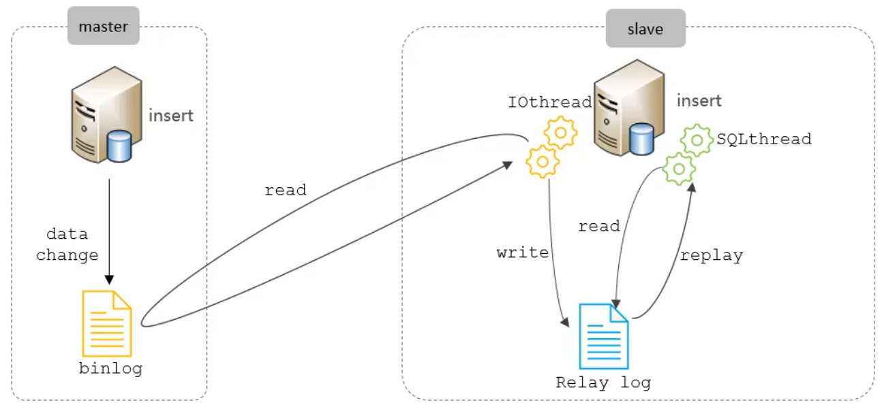

# 日志

## 错误日志

记录运行过程中发生的任何严重错误的相关信息，默认为mysqld.log

```sql
SHOW VARIABLES LIKE '%log_error%';
```

## 二进制日志

二进制日志 BINLOG 记录所有的 DDL 语句和 DML 语句，但不包括数据查询语句。用于灾难恢复，主从复制。

```sql
SHOW VARIABLES LIKE '%log_bin%';
```

| 日志格式  | 含义                                                 |
| --------- | ---------------------------------------------------- |
| STATEMENT | 记录对数据修改的SQL语句                              |
| ROW       | 记录行的数据变更（默认格式）                         |
| MIXED     | 混合两种模式，默认采用statement，特殊情况下会使用row |

### 日志删除

* reset master 删除全部日志，删除后新日志编号从000001开始
* purge master logs to 'binlog.xxxx' 删除指定编号前
* purge master logs before 'yyyy-mm-dd hh:mm:ss' 删除指定日期前

## 查询日志

```sql
SHOW VARIABLES LIKE '%general%';
```

## 慢查询日志

记录执行时间超过 `long_query_time` 并且扫描记录数不小于 `min_examined_row_limit `的查询，默认为10s。

# 主从复制

将主数据库的DDL和DML操作通过二进制日志传到从数据库中，在从库上执行重做，使得从库与主库数据一致

MySQL支持一个从库作为其他库的主库，实现链式复制

* 主库出现问题可以快速切换
* 实现读写分离，降低主库压力
* 在从库中备份，避免备份期间对主库的影响



1. 主库在提交事务时，把数据变更记录在二进制日志中
2. 从库读取主库的二进制日志，写入从库的中继日志 relay log
3. 从库重做中继日志

# 分库分表

热点数据太多，导致IO过多，CPU压力过大，网络压力太大

## 拆分方式

### 垂直拆分

垂直分库：根据业务将不同的表放在不同的库中

垂直分表：将一张表的不同字段分别存放在两张表中，并存放于不同的服务器

### 水平拆分

水平拆分：每个库的表结构都一样，但数据不一样


# 读写分离
