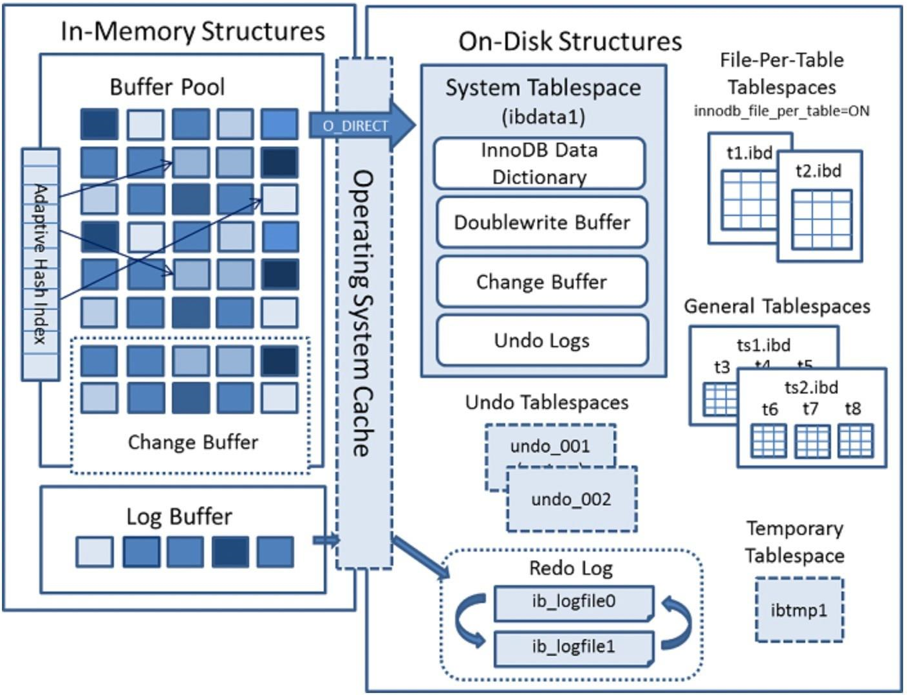
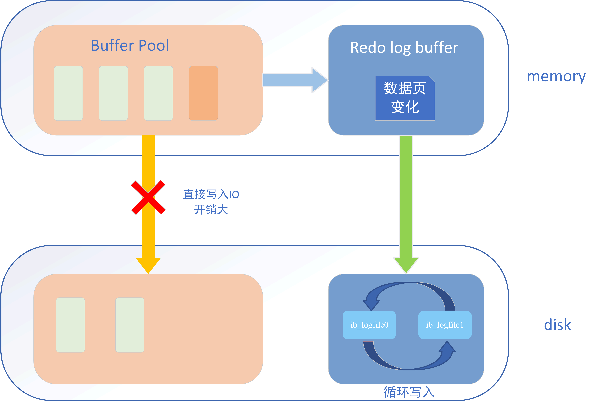
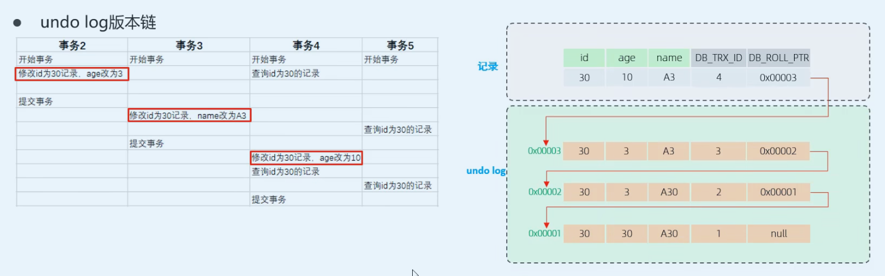

# 存储引擎


默认存储引擎：InnoDB

```sql
CREATE TABLE (
...
) ENGINE=InnoDB;
```

|       Engine       | Support |                            Comment                            | Transaction | XA | Savepoints |
| :----------------: | :-----: | :------------------------------------------------------------: | :---------: | :-: | :--------: |
|       MEMORY       |   YES   |  "Hash based, stored in memory, useful for temporary tables"  |     NO     |    |            |
|     MRG_MYISAM     |   YES   |             Collection of identical MyISAM tables             |     NO     | NO |     NO     |
|        CSV        |   YES   |                       CSV storage engine                       |     NO     | NO |     NO     |
|     FEDERATED     |   NO   |                 Federated MySQL storage engine                 |            |    |            |
| PERFORMANCE_SCHEMA |   YES   |                       Performance Schema                       |     NO     | NO |     NO     |
|       MyISAM       |   YES   |                     MyISAM storage engine                     |     NO     | NO |     NO     |
|       InnoDB       | DEFAULT |  "Supports transactions, row-level locking, and foreign keys"  |     YES     |    |            |
|      ndbinfo      |   NO   |        MySQL Cluster system information storage engine        |            |    |            |
|     BLACKHOLE     |   YES   | /dev/null storage engine (anything you write to it disappears) |     NO     | NO |     NO     |
|      ARCHIVE      |   YES   |                     Archive storage engine                     |     NO     | NO |     NO     |
|     ndbcluster     |   NO   |               "Clustered, fault-tolerant tables"               |            |    |            |

## InnoDB

DML操作遵循ACID模型，支持事务；行级锁，提高并发性能；支持外键约束

文件结构：表空间文件 table_name.ibd，默认一张表对应一个文件

逻辑存储空间：TableSpace, Segment, Extent, Page, Row

如果对事务完整性有较高要求，并有并发需求，除了插入和查询外，还有更新和删除操作，InnoDB是比较合适的选择

## MyISAM

不支持外键、事务，支持表锁不支持行锁，访问速度快

文件结构：table_name.sdi 储存表结构信息，table_name.MYD 储存数据，table_name.MYI 储存索引

如果以插入和查询为主，很少有删除更新操作，对事务要求低，如日志系统，MyISAM更合适，现在常用MongoDB

## Memory

存储在内存中，只能作为临时表或缓存，访问速度快，支持哈希索引

文件结构：table_name.sdi 储存表结构

对表的大小有限制，且无法保证数据安全性，通常用于临时表和缓存，现在常用Redis

# 索引

 索引在存储引擎层实现

| 索引            | 描述                                                       | InnoDB        | MyISAM | Memory |
| --------------- | ---------------------------------------------------------- | ------------- | ------ | ------ |
| B+树            | 最常见                                                     | 支持          | 支持   | 支持   |
| 哈希索引        | 底层由哈希表实现，只有精确匹配的查询才有效，不支持范围查询 | 不支持        | 不支持 | 支持   |
| R树（空间索引） | MyISAM的特殊索引类型，用于地理空间数据类型                 | 不支持        | 支持   | 不支持 |
| 全文索引        | 通过建立倒排索引，快速匹配文档                             | 5.6版本后支持 | 支持   | 不支持 |

## 索引结构

### B树

对于m阶B树，每个节点最多有m个子节点，根节点至少有两个子节点，根节点中关键字为1-（m-1）个，非根节点至少有m/2个。

搜索性能等价于在关键字全集中进行一次二分搜索，相较于二叉树，B树层数少，磁盘IO少

插入节点时，要分裂已满的节点，即将该节点中居中的节点提取并入父节点，剩下两部分作为子节点，若父节点也满，则重复分裂。

删除节点时要合并节点数不足m/2的兄弟节点。

### B+树

与B树不同，B+树中所有数据都存储在叶子节点中，非叶子节点只保存索引，叶子节点保存为一个单链表

在B树中，每个节点保存为一个页，查询时会访问多个页，而在B+树中，一个页可以保存多个索引，减小了查询时磁盘访问次数

在MySQL中，B+树的叶子节点保存为双向循环链表

### 哈希索引

对每行键值计算hash值，冲突时使用链表

哈希索引只支持等值比较，无法排序，但通常效率高于B+树

在MySQL中，Memory引擎支持哈希索引，但在InnoDB中支持自动哈希

## 索引分类

| 分类 | 含义             | 特点           | 关键字   |
| ---- | ---------------- | -------------- | -------- |
| 主键 | 主键索引         | 默认创建，唯一 | PRIMARY  |
| 唯一 | 避免列值重复     | 可以多个       | UNIQUE   |
| 常规 | 快速定位特定数据 | 可以多个       |          |
| 全文 | 查找文本关键字   | 可以多个       | FULLTEXT |

在InnoDB中

| 分类                        | 含义                                               | 特点         |
| --------------------------- | -------------------------------------------------- | ------------ |
| 聚集索引（Clustered Index） | 数据和索引存放在一起，索引结构的叶子节点保存行数据 | 必须有且唯一 |
| 二级索引（Secondary Index） | 数据与索引分开存放，索引结构的叶子节点关联数据     | 可以多个     |

如果存在主键，主键是聚集索引，不存在主键则使用第一个UNIQUE索引作为聚集索引

如果不存在合适的索引，InnoDB会自动生成rowid作为隐含的聚集索引

二级索引查找出主键值，再根据主键值在聚集索引中查找对应行数据

## 索引语法

```sql
-- 创建索引
CREATE [UNIQUE|FULLTEXT] INDEX index_name ON table_name (index_col_name);

-- 查看索引
SHOW INDEX FROM table_name;

-- 删除索引
DROP INDEX index_name ON table_name;
```

## SQL 性能分析

```sql
-- 查询SQL执行频率
SHOW GLOBAL STATUS LIKE 'Com_____';
```

### 慢查询日志

记录耗时超过指定值的查询语句

```sql
-- 查询是否开启慢查询
SHOW VARIABLES LIKE 'slow_query_log';
```

在 my.cnf 中配置 slow_query_log 和 long_query_time

慢日志文件 {host}-slow.log

### profile 详情

记录详细的执行用时

```sql
-- 开启profiles
SELECT @@PROFILING;
SET PROFILING=1;

-- 查看所有命令执行用时
SHOW PROFILES;

-- 查看具体命令的执行用时、cpu占用
SHOW PROFILE [CPU] FOR {QUERY id};
```

### explain 执行计划

```sql
DESC|EXPLAIN SELECT ... FROM ...;
```

Explain 中个字段的意义

* id：同id由上到下执行，不同id较大先执行
* select_type：SIMPLE, PRIMARY, UNION, SUBQUERY
* type：访问类型，由好到差分别为NULL, system, const（根据唯一索引查询）, eq_ref, ref（非唯一索引）, range, index（遍历索引树）, all（全表扫描）
* possible_keys：可能用到的索引
* keys：用到的索引
* key_len：使用的索引字节长度
* rows：MySQL认为必须要执行查询的行数，是估计值
* filtered：返回值占全部值的多少

### 索引的使用

**最左前缀法则：联合索引要保证最左侧的列存在，并且中间的列存在，不能跳过，才会使用索引查询，否则全表查询**

范围查询（>, <)：联合索引中出现范围查询，则右侧的列索引失效，可使用>=, <=来规避

#### 索引失效

* 在索引列上进行计算会导致索引失效
* 字符串类型不加单引号会索引失效（会发生隐式转换，使得索引失效）
* 尾部模糊匹配不会失效，头部模糊匹配会失效
* or 连接的连接的条件，若or前的条件有索引，但之后的条件没有索引，前面的索引也会失效
* 若MySQL判断全表扫描比索引更快，会放弃使用索引，如返回结果超过表的半数，全表扫描更快，取决于数据分布情况

#### 索引提示

可以指定查找时使用哪个索引

```sql
-- 建议使用
SELECT ... FROM ... USE INDEX(...) WHERE ...;
-- 忽略索引
SELECT ... FROM ... IGNORE INDEX(...) WHERE ...;
-- 强制使用
SELECT ... FROM ... FORCE INDEX(...) WHERE ...;
```

#### 覆盖索引

覆盖索引指索引中已包含需要搜索的结果，无需回表查询

要减少 SELECT * 的使用，如果查询的字段在索引列中能找到，那么查询效率会高，否则需要回表查询剩余字段

指定要查询的列，可以减少查询时间

#### 前缀索引

```sql
CREATE INDEX idx_xxx table_name(column_name(length));
```

前缀长度的选择：选择性指不重复索引值占表记录总数的比值，要选择选择性尽可能大的前缀长度

```sql
-- 计算前缀长为N的选择性
SELECT COUNT(DISTINCT SUBSTRING(column_name, 1, N)) / COUNT(*) FROM table_name;
```

#### 单列索引和联合索引

 为了避免回表查询，可以对常用的查询字段建立联合索引，并使用索引提示来避免回表查询

#### 索引设计原则

1. 针对数据量大,查询频繁的表建立索引
2. 对于常用于 where, order by, group by的字段建立索引, 利用联合索引
3. 选择区分度高的字段建立索引, 多建立唯一索引
4. 尽量使用联合索引, 减少单列索引
5. 对于较长的字符串建立前缀索引
6. 控制索引的数量, 减少维护索引的开销
7. 若索引列不能存储NULL, 在创建时用 NOT NULL约束, 优化器知道是否包含NULL值后可以更好地确定应该使用的索引

### SQL 语句优化

#### 插入优化

1. 批量插入
2. 手动事务提交
3. 主键顺序插入，顺序性能高于乱序
4. 使用LOAD指令，从磁盘中加载数据

```powershell
# 登录时添加 --local-infile 指令
mysql --local-infile -u root -p
```

```sql
SET GLOBAL LOCAL_INFILE=1;
LOAD DATA LOCAL INFILE '/...' INTO TABLE table_name FIELDS TERMINATED BY ',' LINES TERMINATED BY '\N';
```

#### 主键优化

InnoDB中，表数据根据主键顺序存放，这种表称为索引组织表（index organized table IOT）

##### 页分裂

页可以为空，也可填充一半或者填满。每个页包含多行数据，并根据主键排列。当要插入的行对应的页已满，会先将该页分裂，前一半数据不动，后一半数据复制到新页中，并更新链表指针，然后插入新数据。

##### 页合并

当一个页中数据少于阈值时，InnoDB会查找最靠近的页合并数据以优化空间。合并阈值默认为一半。

##### 主键设计原则

1. 降低主键长度
2. 插入时选择顺序，使用AUTO_INCREMENT自增主键
3. 不要使用UUID或其他自然主键，如身份证号
4. 业务操作时避免对主键的修改

#### ORDER BY 优化

using filesort：通过表索引或全表扫描，读取数据后，在缓冲区中完成排序

using index：通过对索引扫描直接获取排序数据，效率更高

#### GROUP BY 优化

要满足最左前缀法则，避免使用临时表

```sql
-- 需要column1，column2的联合索引
SELECT COUNT(*) FROM table_name WHERE column1 = ... GROUP BY column2;
```

#### LIMIT 优化

大数据量情况时，LIMIT耗时会非常长，可以通过覆盖索引和子查询来节省时间

```sql
-- 耗时
SELECT * FROM user LIMIT 10000, 10;
-- 节省时间
SELECT u.* FROM user, (SELECT id FROM user ORDER BY id LIMIT 10000, 10) a WHERE s.id=a.id;

```

#### COUNT 优化

MyISAM 引擎记录了表的总行数，但InnoDB没有，在执行COUNT时需要读取数据，无法直接优化

COUNT(*) 计数记录数

COUNT(column) 计数字段中非空值

COUNT(1) 计数记录数

COUNT 计数的字段没有NOT NULL约束时会判断是否为空，会影响速度，若有NOT NULL约束，只会取值不会判断

COUNT(*) 不会取值，引擎有优化，直接返回总计数，效率最高

### update优化

InnoDB 默认行锁，但若查询字段没有索引，更新操作会加表锁

行锁是针对索引加的锁

# 视图

视图是指计算机数据库中的视图，是一个虚拟表，其内容由查询定义。同真实的表一样，视图包含一系列带有名称的列和行数据。但是，视图并不在数据库中以存储的数据值集形式存在。行和列数据来自由定义视图的查询所引用的表，并且在引用视图时动态生成。

```sql
CREATE [OR REPLACE] VIEW view_name AS SELECT ...;
SELECT * FROM view_name;
```

视图检查选项 with cascaded|local check option 检查修改的条目是否符合视图创建时的条件。

local 只会检查视图创建时的检查选项，cascaded 会检查所涉及的所有视图的检查选项

视图中的行与基础表中的行存在一一对应关系时，才可根据视图更新数据

## 视图的作用

* 视图可以简化用户对数据的理解，简化操作。将常用的查询定义为视图，可以减少后续的操作
* 数据库无法对特定的列和行进行授权，但通过视图可以修改不同用户可查询和可修改的数据
* 视图可以帮助用户屏蔽真是表结构变化带来的影响

# 存储过程

存储过程是数据库SQL语言层面的代码封装与重用

```sql
-- 创建
CREATE PROCEDURE p1()
BEGIN
    SELECT COUNT(*) FROM table_name;
END;

-- 调用
CALL p1();

-- 查看指定数据库的存储过程及状态信息，查询指定的存储过程的定义
SELECT * FROM INFORMATION_SCHEMA.ROUTINES WHERE ROUTINE_SCHEMA = 'XXX';
SHOW CREATE PROCEDURE procedure_name;

-- 删除
DROP PROCEDURE [IF EXISTS] XXX;
```

在命令行中创建存储过程时要用 delimiter 来指定结束符，防止出现；即结束。

```sql
DELIMITER $$
CREATE PROCEDURE p1()
BEGIN
    ... ;
END $$
```

## 变量

### 系统变量

系统变量由系统提供，不会被用户定义，分为全局变量和会话变量

```sql
-- 查看系统变量 默认session级别
SHOW VARIABLES;
SHOW GLOBAL VARIABLES;

-- 查询变量
SHOW SESSION VARIABLES LIKE 'auto%';

-- 查看指定变量
SELECT @@SESSION.AUTOCOMMIT;

-- 设置系统变量
SET SESSION AUTOCOMMIT=0;
SET @@SESSION.AUTOCOMMIT=0;
```

系统变量的修改会在服务器重启后失效，永久修改需要在配置文件中进行

### 用户变量

用户变量只存在于单个会话中

```sql
SET @var_name = ...;
SET @var_name := ...;
SELECT @var_name := ...;
SELECT column_name INTO @var_name FROM table_name;
```

### 局部变量

局部变量只能在 begin - end 块中

```sql
BEGIN
    -- 声明
    DECLARE var_name var_type [DEFAULT];

    -- 赋值
    SET var_name := ...;
    SELECT column_name INTO var_name FROM table_name;
END;
```

### IF 语句

```sql
IF condition1 THEN 
    ...;
ELSEIF condition2 THEN
    ...;
ELSE
    ...;
END IF;
```

### 存储类型的参数 IN, OUT, INOUT

| 类型  | 含义                         |
| ----- | ---------------------------- |
| IN    | 参数作为输入，需要传值       |
| OUT   | 参数作为输出                 |
| INOUT | 参数既可作为输入也可作为输出 |

```sql
CREATE PROCEDURE p1(IN name VARCHAR(10), OUT score INT)
BEGIN
    SELECT score INTO score FROM stu WHERE name = name;
END;

CALL p1('Bob', @score);
```

### case 语句

```sql
CASE case_value
    WHEN when_value1 THEN statement_list1
    WHEN when_value2 THEN statement_list2
    [ELSE ...]
END CASE;
```

### while 语句

```sql
WHILE ... DO
   ...
END WHILE;
```

### repeat 语句

```sql
REPEAT
    ...
    UNTIL ...
END REPEAT;
```

### loop 语句

```sql
[label:] LOOP
    ...
    -- 结束当前loop
    [LEAVE label;]
    -- 跳转至下一循环
    [ITERATE label;]
END LOOP [label]
```

### 游标 cursor

```sql
-- 声明
DECLARE cursor_name CURSOR FOR select_statement;

-- 打开
OPEN cursor_name;

-- 获取记录
FETCH cursor_name INTO var;

-- 关闭
CLOSE cursor_name;

```

# 锁

存储锁情况的表：performance_schema.data_locks

## 全局锁

对整个数据库实例加锁，变成只读，常用于数据库的全库逻辑备份

```sql
FLUSH TABLES WITH READ LOCK;
```

```powershell
mysqldump -uroot -p1234 table_name>table_name.sql
```

```sql
UNLOCK TABLES;
```

## 表锁

* 表共享读锁（read lock），阻塞写，共享读
* 表独占写锁（write lock），阻塞读写

```sql
LOCK TABLE table_name WRITE|READ;
```

### 元数据锁 Meta Data Lock

元数据锁是系统自动控制，用于避免表结构的改变。当对一张表进行增删改查时会加MDL读锁（包括共享读锁和共享写锁），对表结构修改时会加MDL写锁

### 意向锁

用于减少表锁的检查

意向共享锁（IS）：与表锁共享锁兼容，与表锁排他锁互斥 select ... lock in share mode

意向排他锁（IX）：与表锁共享锁及排他锁互斥。意向锁之间不会互斥 indsert update delete...

### 行级锁

操作时锁住对应的行数据，并发度最高。在InnoDB中，数据是基于索引组织的，行锁是通过对索引项加锁实现的，不是对记录加锁。

* 行锁（记录锁，Record Lock）：锁定单个记录，防止其他事务的更新和删除，在RC、RR隔离级别下支持
* 间隙锁（Gap Lock）：锁住索引记录的间隙，防止其他事务插入，确保索引记录间隙不变，避免幻读。在RR级别下支持
* 临键锁（Next-Key Lock）：行锁和间隙锁的组合，在RR级别下支持

#### 行锁（记录锁，Record Lock）

共享锁（S）、排他锁（X）

增删改：自动加排他锁

查询语句：无锁

SELECT ... LOCK IN SHARE MODE：共享锁

SELECT ... FOR UPDATE：排他锁

默认情况下，InnoDB在可重复读级别运行，使用next-key锁间隙搜索和索引扫描

对唯一索引进行检索时，对已存在的纪录进行等值匹配，自动优化为行锁。但行锁是针对索引添加的，当通过无索引的字段进行检索时，行锁会升级为表锁

#### 间隙锁和临键锁

* 在唯一索引上查询，并对不存在的数据进行插入或更新时，会使用间隙锁。阻塞其他事务的插入。
* 在普通索引上进行等值查询时，向右遍历到最后一个值不满足查询条件时，临键锁会退化为间隙锁。即不锁住下一个不满足条件的数据，而是锁住满足条件的数据后的间隙，防止其他事务插入，出现幻读

# InnoDB引擎


表空间->段->区->页->行

## 存储结构

* 表空间：idb文件。一个mysql实例可以对应多个表空间，用于存储记录、索引等数据
* 段：分为数据段、索引段、回滚段，数据段是B+树的叶子节点，索引段是非叶子节点
* 区：表空间中的单元结构，大小为1M，默认情况页大小16K，即一个区中有连续64个页
* 页：磁盘管理的最小单元。为保证页的连续性，InnoDB在申请磁盘空间时会一次申请4-5个区
* 行：数据按行存放，trx_id：隐藏列，最后一次修改内容的事务id，roll_pointer：回滚指针

## 架构



### 内存结构

#### Buffer Pool

缓冲池是内存中的区域，存放检查操作的真实数据，在执行增删改查时先操作缓冲池的数据，如果没有则从磁盘加载并缓存，再以一定频率更新磁盘，减少IO

缓冲池以页为单位，底层采用链表结构，页状态分为三类：

* free page：空闲页
* clean page：有数据但未被修改
* dirty page：脏页，数据被修改过，与磁盘不一致

#### Change Buffer

如果增删改操作的数据（针对于非唯一二级索引页）不在Buff Pool中，则将数据变更保存在Change Buffer中，在未来数据被读取时将数据合并到Buffer Pool中，再刷新到磁盘中，减少磁盘IO

与聚集索引不同，二级索引通常是非唯一的，删除更新等操作可能影响不相邻的二级索引页，会造成大量IO

#### 自适应哈希 Adaptive Hash Index

用于优化Buffer Pool中数据的查询，InnoDB会检测对个索引页的查询，如果哈希对查询效率有提升，则会自动添加哈希索引

#### Log Buffer

将日志保存在日志缓冲区，默认为16M，以一定频率写入磁盘。

### 磁盘结构

#### System Tablespace

系统表空间是更改缓冲区的存储区域，如果有表在系统表空间中，系统表空间也会存放索引结构和表结构

#### File-Per-Table Tablespaces

如果独立表空间选项开启，所有表的表空间文件都会存放在File-Per-Table 表空间中

#### General Tablespaces

需要手动指定创建，在创建表的时候可以指定将表存放在通用表空间。

```sql
CREATE TABLESPACE somespace ADD DATAFILE 'xxx.idb' ENGINE=InnoDB;
CREATE TABLE ... TABLESPACE somespace;
```

#### Undo Tablespaces

默认会有undo_001和undo_002两个文件

#### Temporary Tablespaces

临时表空间

#### Doublewite Buffer Files 双写缓冲区

将数据从Buffer Pool写入磁盘前，会先将数据页写入双写缓冲区，便于异常时恢复数据 .dblwr

#### Redo Log

重做日志，用于实现事务的持久性，重做日志缓冲 redo log buffer 以及重做日志文件 redo log，前者在内存中，后者在磁盘中。当事务提交后会把所有修改信息都保存在日志中，用于将Buffer Pool中脏页写入磁盘发生错误时恢复数据。会循环写入 ib_logfile0 和 ib_logfile1。

### 后台线程

#### Master Thread

负责调度其他线程，负责将缓冲池中数据异步刷新到磁盘，保持数据一致性，包括脏页刷新，合并插入数据，undo页的回收

#### IO Thread

InnoDB大量使用AIO来处理IO请求，IO线程用于处理这些请求的回调

| 线程                 | 默认数量 | 职责                   |
| -------------------- | -------- | ---------------------- |
| Read Thread          | 4        | 读操作                 |
| Write Thread         | 4        | 写操作                 |
| Log Thread           | 1        | 将日志缓冲区刷新到磁盘 |
| Insert Buffer Thread | 1        | 将写缓冲区刷新到磁盘   |

```sql
SHOW ENGINE InnoDB STATUS;
```

#### Purge Thread

回收事务提交的undo log

#### Page Cleaner Thread

协助主线程刷新脏页到磁盘的线程，减轻主线程的工作压力，减少阻塞

## 事务原理

一组不可分割的操作，遵循ACID原则

原子性、一致性、持久性由 redo log 和 undo log 保证，隔离性由锁和 MVCC 保证

### redo log

记录事务提交时数据页的物理修改，用来实现事务的持久性。分为重做日志缓冲（redo log buffer）以及重做日志文件（redo log file），分属内存和磁盘。事务提交后会将修改的信息存放到日志中，用于刷新脏页到磁盘发生错误时恢复数据。



### undo log

回滚日志，用于记录数据被修改前的信息，用于回滚和MVCC

undo log 和 redo log 不同，undo log是逻辑日志，记录与当前操作相反的操作，即一个insert语句会在undo log日志中记录delete语句。

undo log销毁：在事务执行时产生，提交时不会立即删除，因为可用于MVCC

undo log存储：采用段的方式进行管理和记录，存放在rollback segment中，占1024个段。

## MVCC 多版本并发控制

当前读：读取数据的最新版本，读取时会对记录加锁，保证其他事务不能修改，如 `select .. lock in share mode`， `select ... for update`，`update`，`insert`，`delete`。由于隔离级别一般为可重复读，如果另一个事务修改了数据并已提交，当前事务不会读取到更新后的数据

快照读：读取数据的历史版本，不加锁的简单读都是快照读。Read Commited级别每一次读都生成快照读，Repeatable read级别第一次读会生成快照读，Serializable级别每次都是当前读

MVCC：Multi-Version Concurrency Control，维护一个数据的多个版本，使得读写没有冲突。快照读为MySQL提供一个非阻塞读功能。MVCC具体实现依赖于数据库记录中三个隐藏字段、undo log日志和 readView

### 隐藏字段

在数据行中有三个隐藏字段 `DB_TRX_ID`（最近修改事务ID）， `DB_ROLL_PTR`（回滚指针，指向这条记录的上一个版本，配合undo log）， `DB_ROW_ID`（隐藏主键，如果表没有指定主键才会生成）。

### undo log

回滚日志，在插入，更新和删除时产生，用于数据回滚。当插入时，回滚日志只在回滚时需要，事务提交后删除。在更新和删除时，回滚日志不仅在回滚时需要，在快照读时也需要，不会被立即删除。



### read view

read view 是快照读执行时 MVCC 提取数据的依据，记录并维护系统当前活跃的事务id

| 字段           | 含义                                 |
| -------------- | ------------------------------------ |
| m_ids          | 当前活跃事务ID集合                   |
| min_trx_id     | 最小活跃事务ID                       |
| max_trx_id     | 预分配事务ID，即当前活跃事务最大ID+1 |
| creator_trx_id | 创建 ReadView 的事务ID               |

版本数据链访问规则（当前事务id：trx_id）：

* trx_id == creator_trx_id：可以访问该版本，说明数据是当前事务更改的
* trx_id < min_trx_id：可以访问该版本，说明事务已提交
* trx_id > max_trx_id：不可以访问该版本，说明事务是在Read View 生成后才开启
* min_trx_id <= trx_id <= max_trx_id

生成Read View时会根据版本数据链依次寻找符合条件的数据版本，作为查询的快照读。

[参考](https://blog.csdn.net/filling_l/article/details/112854716)

### RC级别的访问规则

每一次快照读都会生成Read View

### RR级别访问规则

第一次读时生成Read View，后续读会使用同一个Read View

### 注意

`select ... lock in share mode;` 是当前读，即结果可能和 `select ...;` 不同，即使是在同一事务中。

# MySQL管理

## MySQL自带表

| 表                 | 用途                       |                                        |
| ------------------ | -------------------------- | -------------------------------------- |
| mysql              | 储存MySQL运行时需要的信息  | 用户名密码，时区，主从复制信息等       |
| information_schema | 提供访问数据库元数据的视图 | 引擎信息，表空间，数据库权限，存储过程 |
| performance_shema  | 监控数据库服务器运行状态   | 加锁情况，异常日志，事务信息等         |
| sys                | 性能调优和诊断的视图       |                                        |
