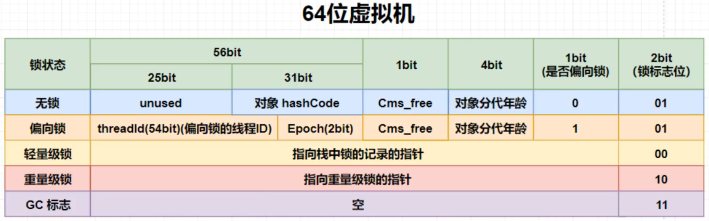

# Java 并发编程

volatile的底层实现：对内存区域的缓存加lock（缓存行锁定）

1. 将当前处理器缓存行的数据立即写回内存
2. 写回操作使其他cpu的缓存该地址的数据无效（内存一致性协议）
3. 提供内存屏障功能，使lock前后指令不能重排

## mesi 内存一致性协议

变量有四种状态，初始都是shared，当有一个修改了之后回立刻同步到进程中共享内存，然后总线上嗅探机制将其他线程的同一个变量的复制标记为invalid，当需要使用时再从进程中获取

并发三大特性：可见性，有序性，原子性

计算机会指令重排，导致执行顺序与代码不一致

java重排序规范：as-if-serial 和 happens-before

this 逃逸：未被初始化完成便被外界访问到

## 内存屏障

| 屏障           | 指令实例                       | 说明                                                                          |
| -------------- | ------------------------------ | ----------------------------------------------------------------------------- |
| `LoadLoad`   | `Load1; LoadLoad; Load2`     | 保证 `Load1` 在 `Load2` 以及后续的读操作之前执行                          |
| `StoreStore` | `Store1; StoreStore; Store2` | 在 `Store2` 以及后面写操作执行前，保证 `Store1` 的写操作已经刷新到内存    |
| `LoadStore`  | `Load1l; LoadStore; Store2`  | 在 `Store2` 以及后面写操作执行前，保证 `Load1` 的读操作已经结束           |
| `StoreLoad`  | `Store1; StoreLoad; Load2`   | 保证 `Store1` 的写操作已经刷新到内存后，`Load2` 以及之后的读操作才能执行 |

在汇编中加了一行，保证指令不会重排

## synchronized

底层是悲观锁（或叫互斥锁，同步锁），对方法使用synchronized，会对对象加锁。底层是对monitor（操作系统级别，非常消耗资源）加锁，在等待锁的线程会加入等待队列（jdk1.6之前），会出现线程阻塞，上下文切换，线程调度等，称为重量级锁。AtomicInteger 底层使用CAS（CompareAndSet，乐观锁，轻量级锁，自旋锁），

```java
while(true) {
    int oldValue = atomicInteger.get();
    int newValue = oldValue + 1;
    if(atomicInteger.compareAndSet(oldValue, newValue))
        break;
}
```

锁状态：

无状态 -> 偏向锁 -> 轻量级锁 -> 重量级锁

偏向锁：有些时候synchronized代码块只有一个线程访问，加锁会耗费资源，偏向锁是在对象中存储线程id，进入synchronized块时只用比较id即可判断是否一直是同一线程在访问。

当出现多个线程访问，偏向锁会升级为轻量级锁，使用CAS竞争访问。当有更多的线程竞争时，使用CAS会导致大量线程空转，耗费CPU时间，此时需要升级为重量级锁。

## 对象组成部分（都在堆中）

对象头，示例数据，对齐填充

### 对象头

元数据指针，指向元空间的.class对象

数组长度（数组对象独有）

Mark Word: 包括HashCode和锁状态：



threadid是偏向锁存储线程id的位置

偏向锁会延时开启，会在虚拟机启动4秒后才会启用，4秒前加锁会直接启用轻量级锁。
