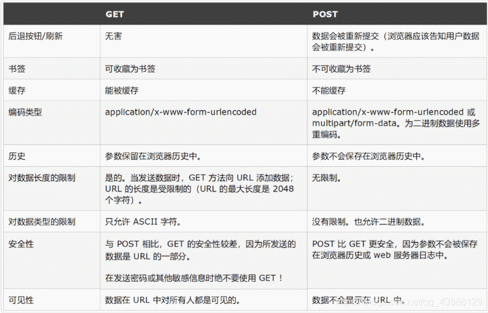

# GET和POST请求的区别

1.报文上的区别
GET 和 POST 只是 HTTP 协议中两种请求方式，所以在传输上，没有区别，因为HTTP 协议是基于 TCP/IP 的应用层协议
报文格式上，不带参数时，最大区别仅仅是第一行方法名不同，一个是GET，一个是POST
带参数时报文的区别呢？在约定中，GET 方法的参数应该放在 url 中，POST 方法参数应该放在 body 中
举个例子，如果参数是 name=qiming.c, age=22。
GET 方法简约版报文可能是这样的
GET /index.php?name=qiming.c&age=22 HTTP/1.1
Host: localhost

POST 方法简约版报文可能是这样的
POST /index.php HTTP/1.1
Host: localhost
Content-Type: application/x-www-form-urlencoded name=qiming. c&age=22

2.GET 方法参数写法是固定的吗？
在约定中，一般我们的参数是写在 ? 后面，用 & 分割。
我们知道，解析报文的过程是通过获取 TCP 数据，用正则等工具从数据中获取 Header 和 Body，从而提取参数。
也就是说，我们可以自己约定参数的写法，只要服务端能够解释出来就行，一种比较流行的写法是这样 :
http://www.example.com/user/name/yourname/age/22

3、POST 方法比 GET 方法安全？
按照网上大部分文章的解释，POST 比 GET 安全，因为数据在地址栏上不可见。
然而从传输的角度来说，他们都是不安全的，因为 HTTP 在网络上是明文传输，只要在网络节点上抓包，就能完整地获取数据报文。
要想安全传输，就只有加密，也就是 HTTPS

# 零拷贝

提高读写性能

# 强引用、软引用、弱引用、虚引用

# Mysql

不能轻易删除大量数据，会产生大量redo log，会造成很大磁盘占用，非常耗时

# Class 文件加载

据说字符串常量池中的字符串在被引用两次之后会在堆内也有，然后字符串引用都指向堆中，常量池中的字符串便会被GC回收
