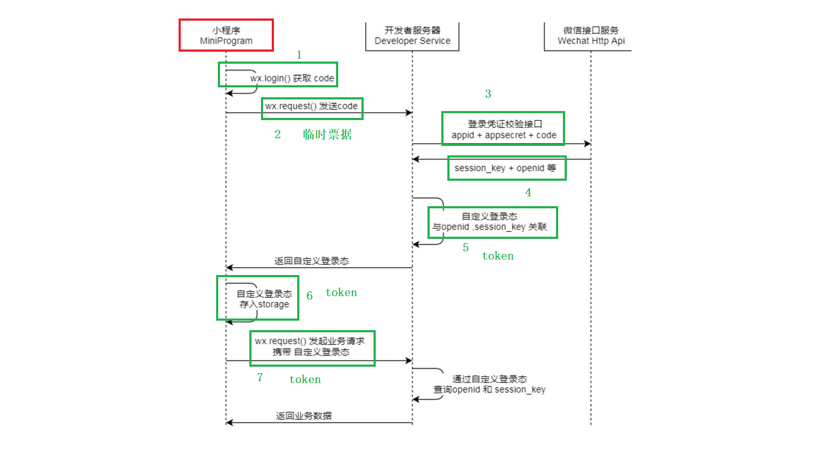
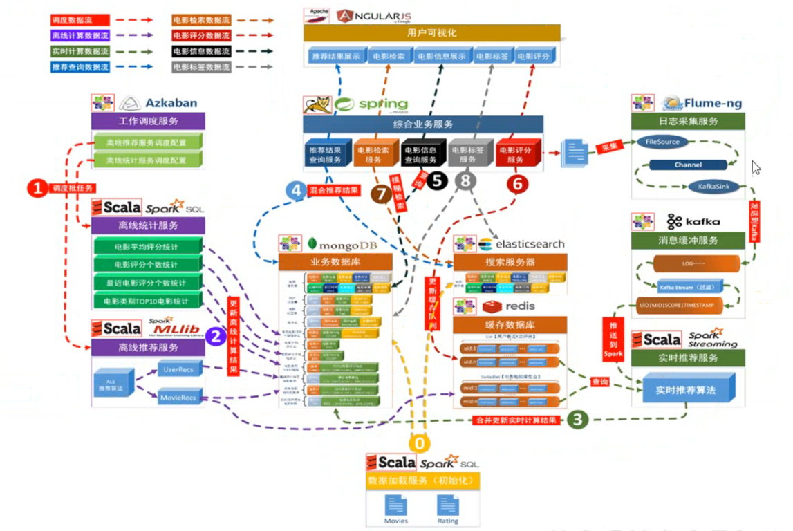
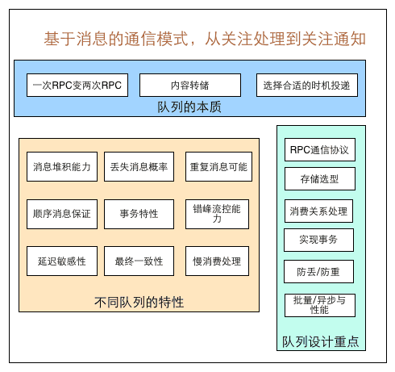

# Initialize Project

## Install Mysql on Aliyun

### Install Apache HTTP Server

```shell
yum -y install httpd httpd-manual mod_ssl mod_perl mod_auth_mysql
systemctl start httpd.service
# visit the ip to validate success
```

### Mysql

```shell
wget http://dev.mysql.com/get/mysql57-community-release-el7-10.noarch.rpm
yum -y install mysql57-community-release-el7-10.noarch.rpm
yum -y install mysql-community-server --nogpgcheck

# check version
mysql -V

# start server
systemctl start mysqld.service

# modify password
grep "password" /var/log/mysqld.log
mysql -uroot -p
```

```sql
set global validate_password_policy=0;  #修改密码安全策略为低（只校验密码长度，至少8位）。
ALTER USER 'root'@'localhost' IDENTIFIED BY '12345678';

# visit from any ip
GRANT ALL PRIVILEGES ON *.* TO 'root'@'%' IDENTIFIED BY '12345678';

```

### PHP

```shell
yum -y install php php-mysql gd php-gd gd-devel php-xml php-common php-mbstring php-ldap php-pear php-xmlrpc php-imap

# create test page
echo "<?php phpinfo(); ?>" > /var/www/html/phpinfo.php

# restart apache server
systemctl restart httpd

# visit http://{ip}/phpinfo.php
```

### phpMyAdmin

phpMyAdmin is a mysql manage tool which allows administrator manage mysql via web interface

```shell
mkdir -p /var/www/html/phpmyadmin
wget --no-check-certificate https://labfileapp.oss-cn-hangzhou.aliyuncs.com/phpMyAdmin-4.0.10.20-all-languages.zip

yum install -y unzip
unzip phpMyAdmin-4.0.10.20-all-languages.zip

# move phpMyAdmin file to mysql data folder
mv phpMyAdmin-4.0.10.20-all-languages/*  /var/www/html/phpmyadmin

# visit http://{ip}/phpmyadmin
```

## Tencent Cloud Mysql

os: ubuntu

connection refused: 修改防火墙端口限制，修改 /etc/mysql/mysql.conf.d/mysqld.cnf 中的bind-address=0.0.0.0

host is not allowed : 修改user表中的 host字段，localhost改为%

更新权限后要使用 flush privileges;

## renren-fast-vue

background management, front-back seperate

install node.js

run

```shell
sudo apt-get install npm
# 全局安装n工具
sudo npm install n -g
n 16.16 # 安装指定版本nodejs

#全局安装命令行工具
npm install --location=global @vue/cli
#创建一个项目
vue create vue-test #选择vue2
#进入到项目目录
cd vue-test
#启动程序
npm run serve
```

## relativepath

在pom文件中的 `<parent> `标签加入 `<relativepath/>`可以正确导入部分依赖

## 安装mysql80

```shell
# 查看ubuntu版本，低版本ubuntu的mysql源不是80
cat /proc/version 

sudo apt-get update

sudo apt-get install mysql-server

# 查看服务运行状态
systemctl status mysql

# 重启服务
service mysql restart

```

```sql
# 删除密码（可选）
use mysql;
update user set authentication_string='' where user='root';
# 修改密码 目前这样会存在问题
alter user u@p identified by 'password';

```

```shell
# 成功的方式是先修改密码强度，会报错，然后去数据库中修改root密码
sudo my_secure_installation

sudo mysql
```

```sql
# 将root登录设置为密码登录，新版本默认是auth_socket
alter user 'root'@'localhost' identified with mysql_native_password by 'password';

# 创建用户
create user 'user'@'%' identified with mysql_native_password by 'password';
grant all privileges on *.* to 'user'@'%' with grant option;
```

```shell
# 查看监听端口
sudo ss -ltn
netstat -tlunp | grep 3306

# 使用netcat侦听本地端口
nc -l 8080

# 查看mysql配置文件
/usr/bin/mysql --verbose --help | grep -A 1 'Default options'

# 开放地址
sudo vim /etc/mysql/my.cnf
# 添加
# [mysqld]
# 
# bind-address=0.0.0.0

```

## SSH端口转发

[端口转发](https://zhuanlan.zhihu.com/p/148825449)

```shell
# 三种使用场景 ssh连接A->B
# A 可以访问公网但无公网ip，想让B访问A
ssh -R portA:localhost:portB user@ipB

# B与C处于同一内网中，A可连接B，要让A访问C，当C和B相同就相当于B自身端口映射
ssh -L portB:ipC:portC user@ipB

# 
```

## Nginx 实现反向代理

```
server {
    listen        port;
    server_name   ip;
  
    location ~ /acl {
        proxy_pass http://localhost:port;
    }

    location ~ /sys {
        proxy_pass http://localhost:port;
    }
}
```

## Linux 配置运行java

```powershell
mkdir -p /usr/local/java/
tar -zxvf jdk-8u241-linux-x64.tar.gz -C /usr/local/java/

mkdir /root/mvn

```

## OSS key

ID: LTAI5tLEni8Ao29wpPqmVwpz
Secret: EKS74f2LMFa1SikVI5kgQKt8fqZYEh

## Linux log analysis

| 命令   | 用途            | 备注                                                                                                                                                                                         |
| ------ | --------------- | -------------------------------------------------------------------------------------------------------------------------------------------------------------------------------------------- |
| ls -lh | 查看文件大小    |                                                                                                                                                                                              |
| cat    | 查看文件内容    | 会读取全部内容，大文件不合适                                                                                                                                                                 |
| less   | 输出一小页内容  | 按需加载                                                                                                                                                                                     |
| tail   | 输出日志末尾    | 查看日志最新部分，less -n 5 查看末尾五行                                                                                                                                                     |
| wc -l  | 计数 PV分析     | -c bytes，-m chars，-l lines，-w words                                                                                                                                                       |
| awk    | 模式分析 PV分组 | 默认将每行按空格分组，相当于split：<br />awk '{print $4}' access.log 在nginx中可筛选访问信息<br />如果只需要部分字符串，还可使用substr函数：<br />awk '{print substr($4, 2, 11)}' access.log |
|        |                 |                                                                                                                                                                                              |

## 跨域

协议，ip，端口号与前端页面本身不一致，会限制访问

解决方法：

在Controller类前添加注释 @CrossOrigin

# 一些Linux命令

| 功能     | 命令 | 备注 |
| -------- | ---- | ---- |
| 查看架构 | arch |      |
|          |      |      |

## RabbitMQ

docker run -d --restart=always -p 5672:5672 -p 15672:15672 --name rabbitmq rabbitmq:3.8-management

## Sping 启动类注解排除扫描

```java
@ComponentScan(excludeFilters = {
        @ComponentScan.Filter(type = FilterType.REGEX, pattern="com.alibaba.cloud.sentinel.*")
})
```

## 设置elastic内存占用

在config/jvm.options.d 文件夹中，复制config/jvm.options 文件，按其中内容修改

## maven 打包报错

```java
class lombok.javac.apt.LombokProcessor (in unnamed module @0x6fd458ec) cannot access class com.sun.tools.javac.processing.JavacProcessingEnvironment (in module jdk.compiler) because module jdk.compiler does not export com.sun.tools.javac.processing to unnamed module @0x6fd458ec
```

解决方法：在设置中修改lombok版本兼容警告

## Docker

### 创建docker镜像：

创建Dockerfile文件

```
FROM dockette/jdk8
VOLUME "/tmp" 
ADD ./service-acl-1.0-SNAPSHOT.jar service-acl.jar
ENTRYPOINT [ "java", "-jar", "/service-acl", "&" ]
```

注意在ENTRYPOINT中，[，] 和字符串间的空格不可省略

| Dockerfile 指令 | 说明                                                                 |
| --------------- | -------------------------------------------------------------------- |
| FROM            | 指定基础镜像，用于后续的指令构建。                                   |
| MAINTAINER      | 指定Dockerfile的作者/维护者。（已弃用，推荐使用LABEL指令）           |
| LABEL           | 添加镜像的元数据，使用键值对的形式。                                 |
| RUN             | 在构建过程中在镜像中执行命令。                                       |
| CMD             | 指定容器创建时的默认命令。（可以被覆盖）                             |
| ENTRYPOINT      | 设置容器创建时的主要命令。（不可被覆盖）                             |
| EXPOSE          | 声明容器运行时监听的特定网络端口。                                   |
| ENV             | 在容器内部设置环境变量。                                             |
| ADD             | 将文件、目录或远程URL复制到镜像中。                                  |
| COPY            | 将文件或目录复制到镜像中。                                           |
| VOLUME          | 为容器创建挂载点或声明卷。                                           |
| WORKDIR         | 设置后续指令的工作目录。                                             |
| USER            | 指定后续指令的用户上下文。                                           |
| ARG             | 定义在构建过程中传递给构建器的变量，可使用 "docker build" 命令设置。 |
| ONBUILD         | 当该镜像被用作另一个构建过程的基础时，添加触发器。                   |
| STOPSIGNAL      | 设置发送给容器以退出的系统调用信号。                                 |
| HEALTHCHECK     | 定义周期性检查容器健康状态的命令。                                   |
| SHELL           | 覆盖Docker中默认的shell，用于RUN、CMD和ENTRYPOINT指令。              |

docker build -t output_name .

### 创建jdk17 镜像

```
FROM centos:7

WORKDIR /data

RUN mkdir /usr/java/
ADD jdk-17_linux-x64_bin.tar.gz /usr/java/
CMD ["yum install -y iputils"]

ENV JAVA_HOME /usr/java/jdk-17.0.8
ENV JRE_HOME $JAVA_HOME/jre
ENV CLASSPATH $JAVA_HOME/bin/dt.jar:$JAVA_HOME/lib/tools.jar:$JAVA_HOME/lib:$CLASSPATH
ENV PATH $JAVA_HOME/bin:$PATH
ENV LANG en_US.UTF-8

RUN /bin/sh -c set -ex \
    && chmod 755 -R /usr/java/jdk-17.0.8

CMD ["java -version"]
CMD ["jshell"]
```

查看docker 网络配置

docker network inspect bridge

## 用户登录

JWT生成token，token包含公共部分（类型，编码方式），私有部分（用户信息），签名（SaltIP，当前服务器ip，主要用户对JWT生成字符串时进行加密） => base64编码，生成字符串

### 用户id生成

雪花算法：时间戳+机器id+序列号

#### UidGenerator

64位分为1-28-22-13，第一位0，第二组位时间戳，以秒为单位（原本为毫秒），第三组位workID，为数据中心和机器ID的组合，第四组是自增序列

默认下workID每次启动时数据库分配，用后即弃，可配置重用

### 使用微信小程序登录



token是唯一标识，用于确认用户

#### Redis 存储用户信息，存储过期时间

## 客户端静态上报

- 展示，点击，等信息要定时上报，可能是负面评价，比如看了但不想点，例如每秒每分钟，但是有延迟，如何避免重复推荐？

服务端应记录短时间的推荐内容，刷新推荐时应避免推荐同id内容（布隆过滤器）。但收到客户端上报后，可以考虑哪些内容没有被曝光，可以考虑捞回重新推荐。

## 项目结构



## 消息队列



Redis 发布订阅模式无法持久化，List LPUSH+BRPOP无法多播，分组消费

### RabbitMQ

配置消息转换器 Jackson2JsonMessageConverter

消息路径：消息生产->交换机 -> 队列1 -> 消费端1

    -> 队列2-> 消费端2

配置消息确认过程：确认消息已被处理，会从MQ中删除

常量类：配置交换机、队列名称

在product服务中发送sku上下架请求至MQ，search模块添加receiver类，配置RabbitListener，即消费端。

发送端和消费端交换机路由Key保持一致

建立ElasticsearchRepository的子类，用于向es中传输数据

## 远程调用

在product模块中创建根据物品id返回相关信息的接口，供search模块远程调用，并将信息同步到elasticsearch中。
